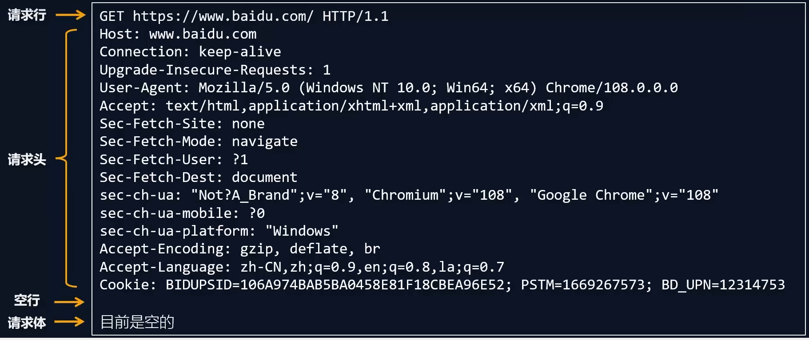
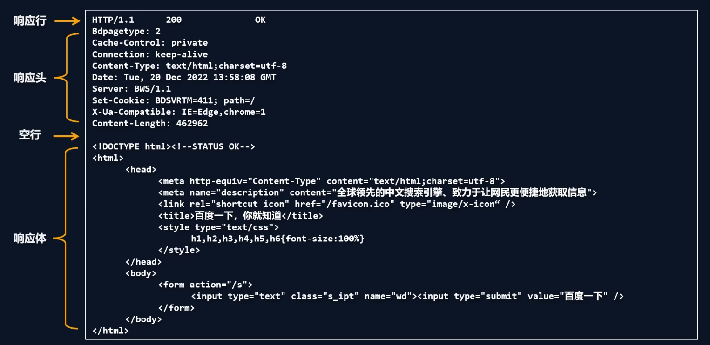
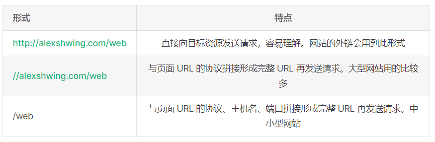
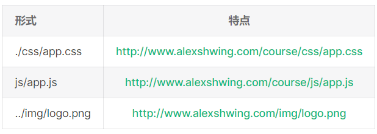

# HTTP

## 1. 概念
`http`(超文本传输协议)是一种基于`TCP/IP`的应用层通信协议
这个协议规定了`浏览器`和`服务器`之间互相通信的规则
协议中主要规定了两方面内容:
- 客户端: 用来向服务器发送数据 (**请求报文**)
- 服务端: 向客户端返回数据 (**响应报文**)

## 2. 请求报文组成

### 2.1 请求行
- 请求方法(`get`、`post`、`put`、`delete`等)
- 请求`URL`(统一资源定位符)
  - `http://www.baidu.com:80/index.html?a=100&b=200#logo`
    - `http` 协议
    - `www.baidu.com` 域名
    - `80` 端口号
    - `/index.html` 路径
    - `a=100&b=200` 查询字符串
    - `#logo` 哈希(锚点连接)
- `HTTP`协议版本号
### 2.2 请求头
格式: `头名: 头值`
- `HOST` 主机名
- `Connection` 连接设置 `keep-alive`(保持连接)、`close`(关闭连接)
- `Cache-Control` 缓存控制 `max-age`(没有缓存)
- `Upgrade-Insecure-Requests` 将网页中`http`请求转化为`https`请求
- `User-Agent` 用户代理, 客户端字符串标识, 服务器可以通过这个标识来识别这个请求来自哪个客户端, 一般在PC端和手机端的区分
- `Accept` 设置浏览器接收数据类型
- `Accept-Encoding` 设置接收的压缩方式
- `Accept-Language` 设置接收语言
- `Cookie`
### 2.3 请求体
- `get`请求: 可以是空
- `post`请求: 可以是字符串或`JSON` 

## 3. 响应报文组成


### 3.1 响应行
`HTTP/1.1 200 OK`
- `HTTP/1.1` `HTTP`协议版本号
- `200` 响应状态码 
- `OK` 响应状态描述

### 3.2 响应头
- `Cache-Control` 缓存控制 `private` 私有的, 只允许客户端缓存数据
- `Connection` 链接设置
- `Content-Type: text/html;charset:utf-8` 设置响应体的数据类型以及字符集, 响应体为`html`, 字符集为 `utf-8` (优先级比 `<meta charset="UTF-8">` 设置的优先级高) 

### 3.3 响应体
响应体内容非常灵活, 常见类型有`HTML`、`CSS`、`JS`、`图片`、`JSON`等

## 4. 创建HTTP服务
```js
const http = require("http")
// req: 可以获取请求报文的数据, res: 可以设置响应报文
const server = http.createServer((req, res) => {
  res.setHeader("content-type", 'text/html;charset=utf-8') // 解决乱码
  res.end("你好")
})
server.list(9000, () => {
  console.log("server has been created")
})
```
- `HTTP` 默认端口`80`, `HTTPS`默认端口`443`, `HTTP`服务开发常用端口`3000`、`8080`、`8090`等

## 5. 获取HTTP请求报文
想要获取请求的数据, 通过`req`对象
- 请求方法 `req.method`
- 请求版本 `req.httpVersion`
- 请求路径 `req.url`
- `URL`路径
- `URL`查询字符串
```js
// 第一种
const pathName = require('url').parse(req.url).pathname
const query = require('url').parse(req.url, true).query
// 第二种
const url = new URL(req.url, "http://127.0.0.1")
const pathName = url.pathname
const keyword = url.searchParams.get('keyword')
```
- 请求头 `req.headers`
- 请求体 
```js
let body = ''
req.on('data', chuck => {
  body += chuck
})
req.on('end', () => {
  console.log(body)
  req.send("ok")
})
```
> 注意事项
>
> 1. `req.url` 只能获取路径以及查询字符串, 无法获取`URL`中域名和协议内容
>
> 2. `req.headers` 将请求信息转化为对象, 并将属性名转化为小写
>
> 3. 关于路径: 如果访问网站的时候, 只填写`IP`地址或者域名信息, 此时请求路径为`/`
>
> 4. 关于`favicon.icon`: 这个请求是属于浏览器自动发送的请求

## 6. 设置HTTP响应报文
- 设置响应状态码 `req.statusCode`
- 设置响应状态描述 `req.statusMessage`
- 设置响应头信息 `req.setHeader('头名', '头值')`
- 设置响应体
```js
// 1. write 和 end 结合
res.write("xx")
res.write("xx")
res.write("xx")
res.end()
// 2. 单独使用 end
res.end('xx')
```
## 7. 静态资源服务
- 静态资源是指`内容长时间不发生改变的资源`, 如`图片`、`视频`、`JS`文件、`CSS`文件、`HTML`文件等
- 动态资源是指`内容经常更新的资源`, 如百度首页、网易首页等
### 7. 1 网站根目录或静态资源目录
`HTTP`服务在哪个文件夹寻找静态资源, 这个文件夹就是`静态资源目录`, 也叫做`网站根目录`

### 7. 2 网页 URL
- 绝对路径
可靠性强, 而且相对容易理解, 在项目中运用较多



- 相对路径
需要与当前页面`URL`进行计算, 得到完整`URL`后再发送请求
当前网页`URL`为`http://www.alexshwing.com/course/h5.html`



### 7. 3 设置资源类型(mine类型)
媒体类型(`MIME`类型)是一种标准, 用来表示文档、文件或字节流的性质和格式

格式: `[type]/[subType]`
```js
html: 'text/html',
css: 'text/css',
js: 'text/javascript',
png: 'image/png',
jpg: 'image/jpeg',
gif: 'image/gif',
mp4: 'video/mp4',
mp3: 'audio/mpeg',
json: 'application/json'
```

### 7. 4 静态资源获取
```js
require('http').createServer((req, res) => {
  // 获取请求方法和路径
  const { url, method } = req
  // 文件夹路径
  const rootDir = __dirname + '/public'
  // 拼接文件路径
  const filePath = rootDir + url
  // 读取文件内容
  fs.readFile(filePath, (err, data) => {
    if (err) {
      res.statusCode = 404
      res.end("<h1>404 Not Found</h1>")
    } else {
      res.end(data)
    }
  })
}).listen(80, () => {
  console.log("server has been created")
})
```

## 8. GET 和 POST
- `GET` 用于获取数据, `POST` 用于 `提交数据`
- `GET` 参数携带于`URL`之后, `POST` 参数携带于请求体
- `GET` 使用场景
  - 在地址栏直接输入 `url `访问
  - 点击` a `链接
  - `link` 标签引入 `css`
  - `script `标签引入 `js`
  - `img` 标签引入图片
  - `form `标签中的 `method `为 `get` （不区分大小写）
  - `ajax` 中的 `get` 请求
- `POST` 使用场景
  - `form` 标签中的 `method` 为 `post`（不区分大小写）
  - `AJAX` 的 `post` 请求