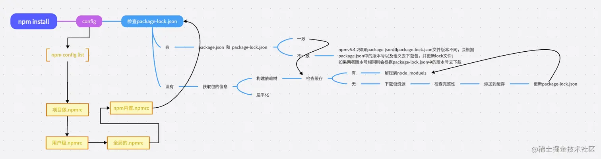
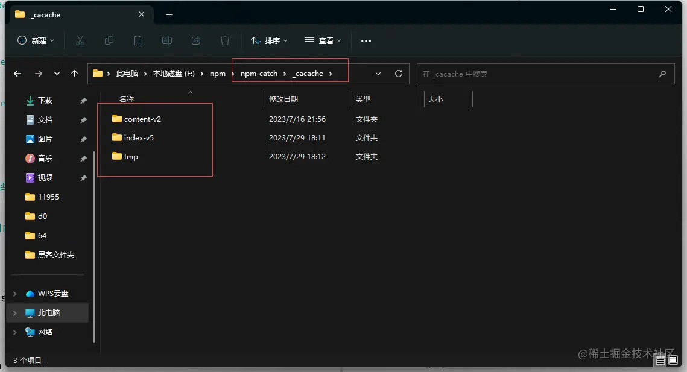
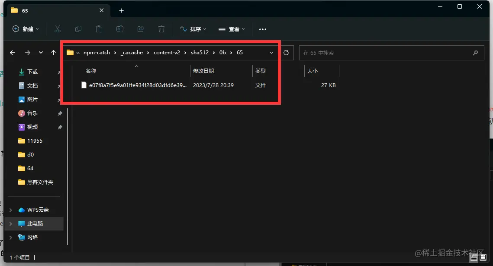

# install

## 在执行 npm install 的时候发生了什么?
> 首先安装的依赖都会存放在根目录的 node_modules, 默认采用扁平化的方式安装, 并且排序规则 .bin 第一个, 然后 @ 系列, 再然后按照首字母排序abcd等, 采用广度优先遍历, 在遍历依赖树时, npm 会首先处理项目根目录下的依赖, 然后逐层处理每个依赖包的依赖, 直到所有依赖都被处理完毕。在处理每个依赖时, npm 会检查该依赖的版本号是否符合依赖树中其他以来的版本要求, 如果不符合要求, 则会尝试安装适合的版本

## npm install 后续流程

## package-lock.json 作用
锁定版本记录, 记录依赖树的详细信息

- version 当前包版本号
- resolved 当前下载地址
- integrity 验证包的完整性
- dev 指定当前包为一个开发依赖包
- bin 指定当前包中可执行文件的路径和名称
- engines 指定当前包所依赖的 Node.js 版本范围

package-lock.json 做了缓存, 通过 name + version + integrity 信息生成唯一的 key , 这个 key 能找到对应的 index.v5 下的缓存记录, 也就是 npm cache 文件夹

如果发现有缓存记录, 就会找到 tar 包的 hash 值, 然后将对应的二进制文件解压到 node_modules 中

:::tip 参考
[Nodejs 第四章（Npm install 原理）](https://juejin.cn/post/7261119531891490877)
:::