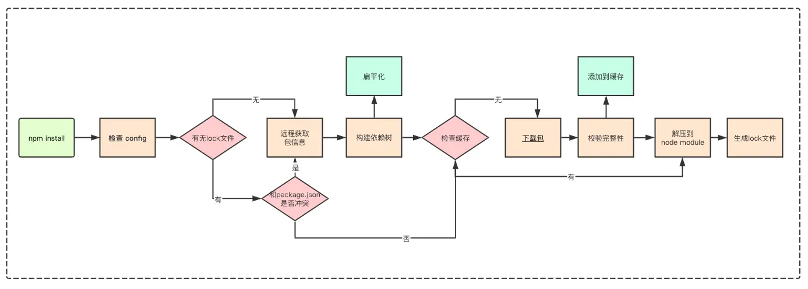

# 剖析npm的包管理机制

## 一、剖析 package.json

### 1. 必备属性
name (模块名称) 和 version

- 通过`npm view packageName` 查看包是否被占用及包的基本信息

### 2. 描述信息
```json
{
  "description": "An enterprise-class UI design language and React components implementation",
  "keywords": [ // 关键字 (有利于检索)
    "ant",
    "component",
    // ...
  ], 
  "author": , // 作者
  "contributors": , // 贡献者
  "homepage": "http://ant.design/", // 指定模块主页
  "bugs": { // bug 提交地址
    "url": "https://github.com/ant-design/ant-design/issues"
  },
  "repository": { // 指定模块的代码仓库
    "type": "git",
    "url": "https://github.com/ant-design/ant-design"
  },
}
```

### 3. 依赖配置
- dependencies: 指定项目运行所依赖的模块(开发和生产环境)
- devDependencies: 开发依赖
- peerDependencies: 指定你正在开发模块所依赖的版本以及用户安装的依赖包版本的兼容性
```json
{
  "peerDependencies": {
    "react": ">=16.0.0" // 保持稳定运行的版本是16.0.0及以上
  }
}
```
- optionalDependencies: 依赖包可有可无, 当这个依赖包无法获取时且希望`npm install`继续运行不会导致失败, 将依赖添加到`optionalDependencies`
- bundledDependencies: 值是一个数组，数组里可以指定一些模块，这些模块将在这个包发布时被一起打包

### 4. 协议
license 用于指定软件的开源协议, 用于他人获得你代码后拥有的权利

### 5. 目录、文件相关
- 程序入口: `main`
- 命令行入口: `bin`
- 发布文件配置: `files` 描述`npm publish`后推送到 npm 服务器的文件列表
- `man` 查看 Linux 的指令帮助、配置文件帮助和编程帮助

### 6. 脚本配置
- 配置脚本命令缩写: `script`
- 配置脚本使用的环境变量: `config`

### 7. 发布配置
- `perferGlobal`: 提示用户该包是安装到全局的命令行工具
- `private`: 防止私有包发布
- `publishConfig`: 发布模块更详细的配置
- `os`: 指定安装系统和不能安装的系统黑名单
- `cpu`: 限制用户安装环境

## 二、剖析包版本管理机制
### 1. 查看 npm 包版本
- `npm view package version` 查看最新版本
- `npm view package versions` 查看所有发布版本
- `npm ls` 当前仓库依赖树上所有包的版本信息

### 2. SemVer 规范
> [SemVer规范官网](https://semver.org/)

标准版本号采用`X.Y.Z`格式
- 主版本号`X`(major): 进行不兼容的 API 修改
- 次版本号`Y`(minor): 做了向下兼容的功能性新增
- 修订号`Z`(patch): 做了向下兼容的问题修正

先行版本: 在`X.Y.Z`后添加连接号再加上一连串以句点分隔的标识符和版本编译信息
- 内部版本(alpha)
- 公测版本(beta)
- 正式版本的候选版本(rc)

发布版本
- `npm version patch` 升级修订版本号
- `npm version minor` 升级次版本号
- `npm version major` 升级主版本号

### 3. 版本工具使用
借助 npm包 `semver` 来进行版本比较、提取版本信息

### 4. 依赖版本管理
- `~` 当安装依赖时获取到新版本时, 安装到 `X.Y.Z` 中 `Z` 最新版本
- `^` 当安装依赖时获取到新版本时, 安装到 `X.Y.Z` 中 `Y` 和 `Z` 最新版本

注意, 主版本号为 0 被认为是一个不稳定版本, 情况与上面不同
- 主版本和次版本都为 0: `^0.0.z`、`~0.0.z`被当作固定版本, 安装依赖不发生变化
- 主版本号为 0: `^0.Y.z`、`~0.Y.z` 只保持修订号为最新版本

`1.0.0`的版本号用于界定公共 API, 当你决定对外部发布一个正式版本的 npm 包, 将它的版本号标为`1.0.0`

### 5. 锁定依赖版本
- lock 文件
  - 锁定依赖版本意味着在我们不手动执行更新的情况下，每次安装依赖都会安装固定版本。
- 定期更新依赖
  - 使用`npm outdated`可以帮助我们列出有哪些还没有升级到最新版本的依赖
  - 执行`npm update`升级所有红色依赖 

### 6. 依赖版本的最佳实践
- 版本发布
  - 正式版本标注`1.0.0`
  - 按照`主版本号.次版本号.修订号` 命名
  - 版本号发布递增
  - 发布重大版本前发布先行版本
- 依赖范围选择
  - 主工程依赖很多子模块, 都是团队成员发布的 npm 包, 将版本前缀改为`~`
- 保持依赖一致
  - npm 版本在 5.6 以上, 默认开启 package-lock.json 文件
  - 初始化成员 `npm install` 后将 package-lock.json 提交到远程仓库, 不直接提交 `node_modules`
  - 定期执行`npm update` 升级依赖, 并提交 lock 文件确保其他成员同步更新依赖, 不手动修改 lock 文件
- 依赖变更
  - 升级依赖: 修改`package.json`文件的依赖版本, 执行`npm install`
  - 降级依赖: 执行`npm install packageName@version`(改动 package.json 文件不会降级)
  - 注意改动依赖后提交`lock`文件


## 三、剖析 npm install 原理


### 1. 嵌套结构
npm 早期采用递归的形式, 按照 package.json 结构以及子依赖包的 package.json 结构将依赖安装到它们对应 node_modules 中

造成嵌套层级过深, 不同层级依赖可能引用同一个依赖, 导致大量冗余

### 2. 扁平结构
npm 在 `3.x` 将结构改为 扁平结构

安装模块时, 不管是直接依赖还是子依赖的依赖, 优先安装在 node_modules 根目录。当安装到相同模块时，判断已安装的模块版本是否符合新模块的版本范围，如果符合则跳过，不符合则在当前模块的 node_modules 下安装该模块。这样子会导致依赖的安装由顺序决定, 带来不可预知问题

### 3. Lock 文件
为了解决 `npm install` 的不确定问题, 在`npm 5.x`版本新增 package-lock.json 文件, 作用是锁定依赖结构, 通过`npm install`后生成的 node_modules 目录结构和package-lock.json 完全相同

项目中使用了 package-lock.json 可以显著加速依赖安装时间。

### 4. 缓存
`npm install` 或 `npm update` 下载依赖后, 会在本地缓存目录中缓存一份

- 通过 `npm config get cache`查询本地缓存目录
  
这个目录下存在两个目录 content-v2 和 index-v5 ,  content-v2 用于存储 tar 包缓存, 而 index-v5 用于存储 tar 包的 hash

npm 在执行安装时，可以根据 package-lock.json 中存储的 integrity、version、name 生成一个唯一的 key 对应到 index-v5 目录下的缓存记录，从而找到 tar 包的 hash，然后根据 hash 再去找缓存的 tar 包直接使用。
> `_shasum` 属性 即为 tar 包的 hash

npm 提供几个命令来管理缓存数据:
- `npm cache add` 主要是 npm 内部使用, 也可以用来手动给一个指定的 package 添加缓存
- `npm cache clean` 删除缓存目录下所有数据, 为了保证缓存数据的完整性，需要加上`--force `参数。
- `npm cache verify` 验证缓存数据的有效性和完整性

基于缓存数据, npm 提供了离线安装模式:
- `--prefer-offline` 优先使用缓存数据, 如果没有匹配的缓存数据，则从远程仓库下载。
- `--prefer-online` 优先使用网络数据，如果网络数据请求失败，再去请求缓存数据，这种模式可以及时获取最新的模块。
- `--offline` 不请求网络，直接使用缓存数据，一旦缓存数据不存在，则安装失败

### 5. 文件完整性
在下载依赖包之前, 一般就能拿到 npm 对该依赖包计算的 hash 值, 例如我们执行`npm info`, 紧跟 tarball(下载链接)的就是 `shasum`(hash)

用户下载依赖包到本地后，需要确定在下载过程中没有出现错误，所以在下载完成之后需要在本地在计算一次文件的 hash 值，如果两个 hash 值是相同的，则确保下载的依赖是完整的，如果不同，则进行重新下载。
### 6. 整体流程
- 检查 `.npmrc` 文件: 优先级为: 项目级的`.npmrc`文件 > 用户级的`.npmrc`文件 > 全局级的`.npmrc`文件 > npm 内置的`.npmrc`文件
- 无 lock 文件
  - 从 npm 远程仓库获取包信息
  - 根据 package.json 构建依赖树, 构建过程:
    - 构建依赖树, 不管是直接依赖还是子依赖的依赖, 优先放置在 node_modules 根目录
    - 当遇到相同模块, 判断已放置在依赖树的模块版本是否符合新模块的版本范围, 如果符合则跳过, 不符合在当前模块的 node_modules 下放置该模块
    - 注意这一步只是确定逻辑上的依赖树，并非真正的安装，后面会根据这个依赖结构去下载或拿到缓存中的依赖包
  - 在缓存中依次查找依赖树的每个包
    - 不存在缓存
      - 从 npm 远程仓库下载
      - 校验包完整性
      - 校验不通过
        - 重新下载
      - 校验通过
        - 将下载的包复制到 npm 缓存目录
        - 将下载的包按照依赖结构解压到 npm_modules 
    - 存在缓存: 价格缓存按照依赖结构解压到 npm_modules
  - 将包解压到 node_modules
  - 生成 lock 文件
- 有 lock 文件
  - 检查 package.json 中的依赖版本是否和 package-lock.json 中依赖版本有冲突
  - 如果没有冲突, 直接跳过获取包信息、构建依赖树过程, 开始在缓存中查找包信息, 后续过程相同


:::tip 参考
- [前端工程化 - 剖析npm的包管理机制](https://juejin.cn/post/6844904022080667661)
:::