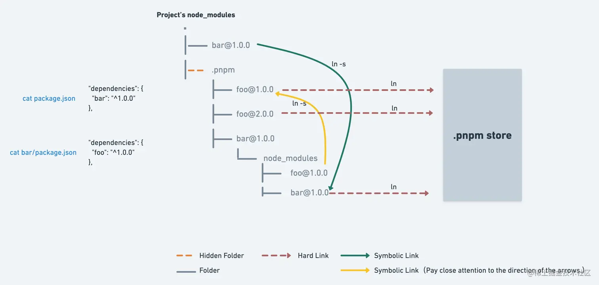

# pnpm
## store
store(类似于 Vuex 中的 store, 全局状态管理) 内部使用「基于内容寻址」的文件系统来存储磁盘上所有文件

基于内容寻址是一种文件系统的设计原则，以文件内容的哈希值作为文件的唯一标识符，并将文件存储在以哈希值命名的目录中

通过 store 目录和基于内容寻址的文件系统，pnpm 能够实现依赖项的共享和重复使用，减少磁盘空间占用，并提高依赖项的安装和管理效率。

pnpm install 过程中，我们会看到如下的信息：其中的 content-addressable store 就是以上提到的 store。Mac 中默认会将 store 设置到 {home dir}>/.pnpm-store/v3。windows 下会设置到当前盘符的根目录下。使用名为 .pnpm-store 的文件夹名称。

## 硬连接 hard link
硬连接是引用的是文件的物理数据而不是文件在文件结构的位置

## 软连接 symbolic link
软连接(符号连接), 是一个指向另一个文件或目录的引用, 类似于创建快捷方式

## .pnpm 
`.pnpm` 为虚拟磁盘目录, 它以平铺的形式存储所有的包。pnpm 使用「软连接 + 平铺」目录结合的方式来构建一个嵌套结构。
```js
node_modules
├── f // 这是一个软连接 连接到 .pnpm/f@1.0.0/node_modules/f
└── .pnpm
       └── f@1.0.0
             └── node_modules
                   └── f -> <store>/f 硬连接
```
- 软连接: `node_modules/.pnpm/f@1.0.0/node_modules/f` 解决一个项目内代码重复引用问题
- 硬连接: `~/.pnpm-store/v3/files/00/xxxd` 解决项目间的包重复拷贝问题

平铺 

f 内部相关依赖会被平铺到`.pnpm/f@1.0.0/node_modules/`下面, 而不是`.pnpm/f@1.0.0/node_modules/f/node_modules/`
```js
node_modules
├── f -> ./.pnpm/f@1.0.0/node_modules/f
└── .pnpm
       ├── b@1.0.0
       │    └── node_modules
       │          └── b -> <store>/b
       └── f@1.0.0
             └── node_modules
                   ├── f -> <store>/f
                   └── b -> ../../b@1.0.0/node_modules/b
```

## 同级依赖
pnpm 确保一个 package 的特定版本只有一组依赖项, 但对于具有同级依赖(peer dependencies) 的 package, 它允许安装多个不同版本的 同级依赖, 以满足不同版本要求的兼容性要求。

比如包 f 同级依赖了 b 与 c ，我们在  Monorepo 环境两个 Package A 和  Package B 下分别安装不同版本的 b 和 c，Package A 安装的是 b@1.0.0+c@1.0.0，Package B 安装的是 b@1.0.0+c@1.1.0，则其在 .pnpm 中的结构为：
javascript复制代码

```js
node_modules
└── .pnpm
     ├── f@1.0.0_b@1.0.0+c@1.0.0
     │     └── node_modules
     │           ├── f
     │           ├── b -> ../../b@1.0.0/node_modules/b
     │           ├── c -> ../../c@1.0.0/node_modules/c
     │           ├── u -> ../../u@1.0.0/node_modules/u
     │           └── p -> ../../p@1.0.0/node_modules/p
     ├── f@1.0.0_b@1.0.0+c@1.1.0
     │     └── node_modules
     │           ├── f
     │           ├── b -> ../../b@1.0.0/node_modules/b
     │           ├── c -> ../../c@1.1.0/node_modules/c
     │           ├── u -> ../../u@1.0.0/node_modules/u
     │           └── p -> ../../p@1.0.0/node_modules/p
     ├── b@1.0.0
     ├── c@1.0.0
     ├── c@1.1.0
     ├── u@1.0.0
     ├── p@1.0.0
```
可以看到，安装了两个相同版本的 f ，对应相同的软链接，但却分别拥有不同的名称： f@1.0.0_b@1.0.0+c@1.0.0 、 f@1.0.0_b@1.0.0+c@1.1.0 。这也是  pnpm 规则严格的体现：任何包都不应该有全局副作用。

## 总结


pnpm 使用软连接和硬连接来优化依赖项的共享和存储, 采用平铺的目录结构来确保每个包的上下文隔离, 同时保留不同版本的包来维持依赖项的一致性。这些设计选择有助于减少磁盘空间占用, 提高安装速度, 并提高可靠依赖项管理。