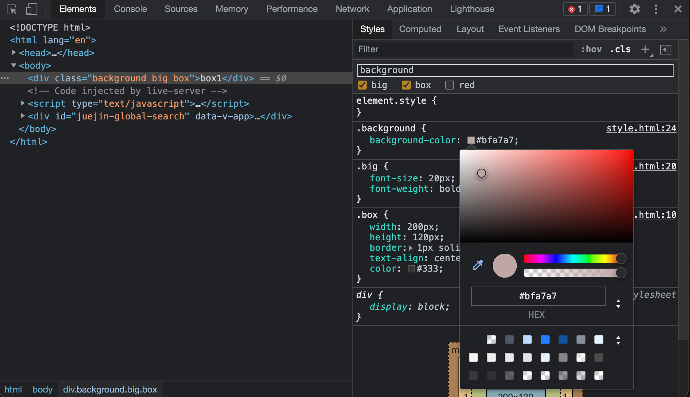
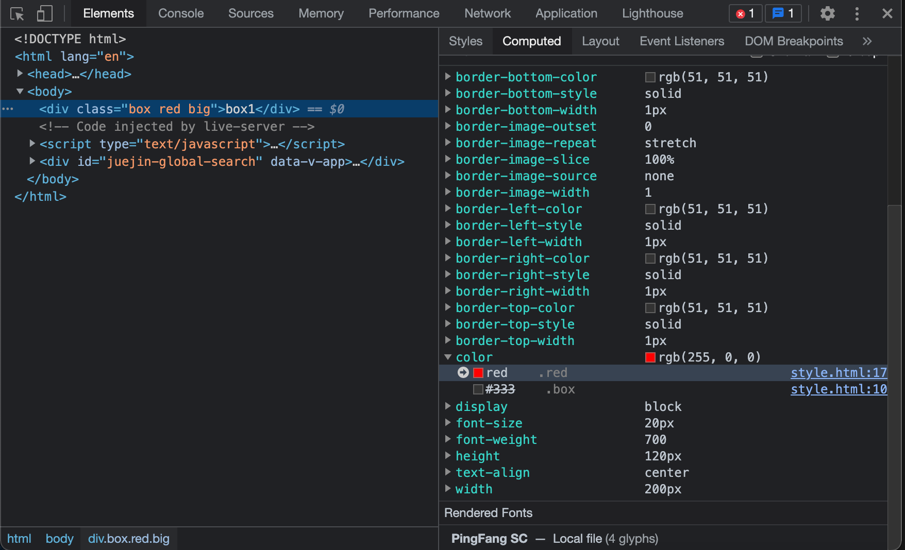
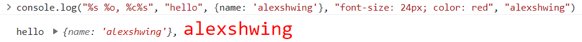
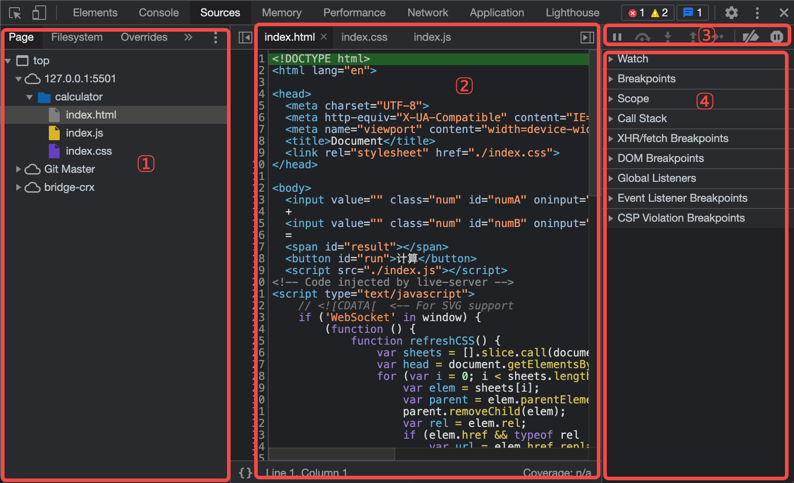
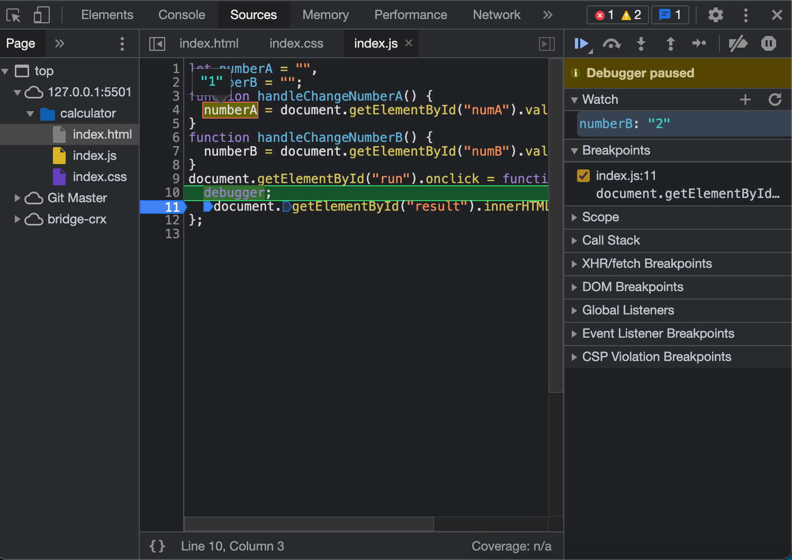
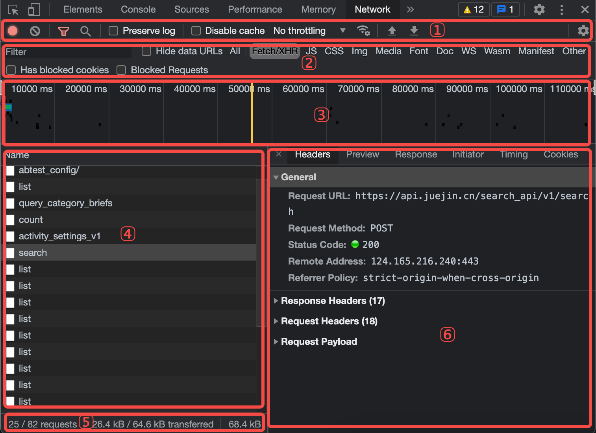
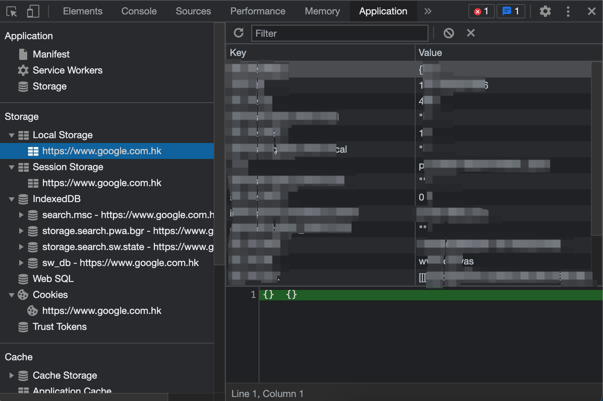
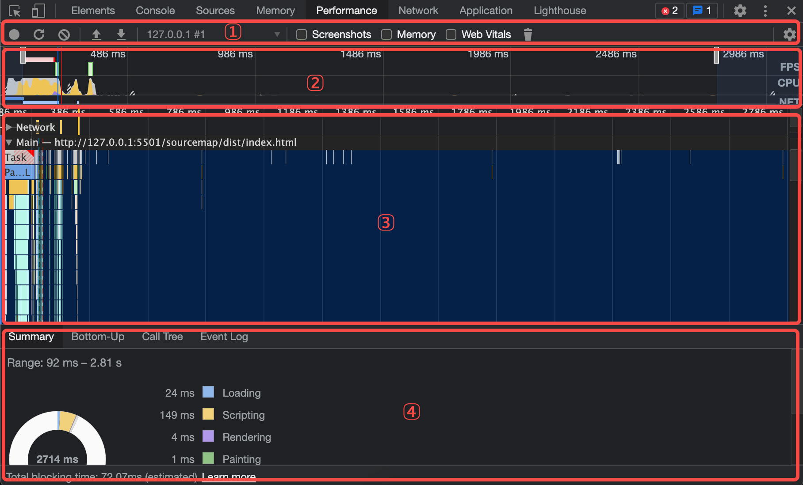
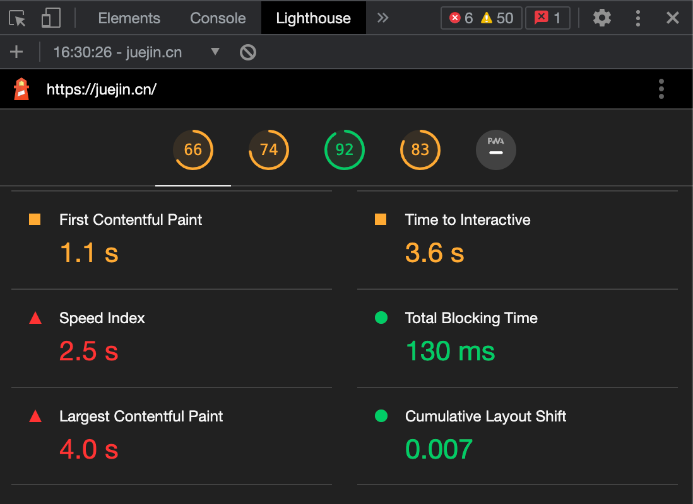
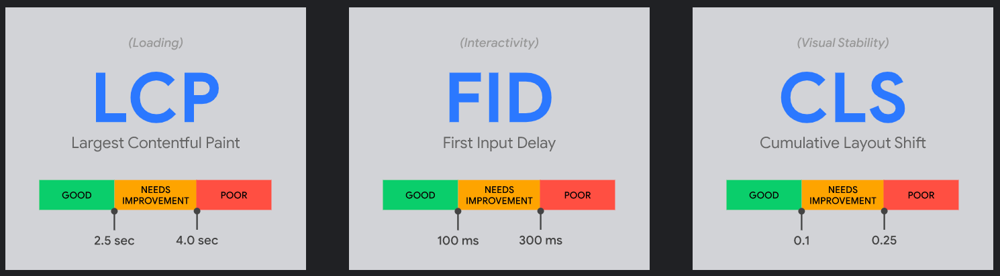

# 前端必须知道的开发调试知识
## 一、 动态修改元素和样式

- 点击 .cls 开启动态修改元素的 class
- 输入字符串动态给元素添加类名
- 勾选类名可以动态地查看类名生效效果
- 点击具体样式值可以进行编辑, 浏览器内部区域实时预览
- computed 点击样式里的箭头可以跳转到 styles 面板中的 css 规则
- 激活伪类
  - 选中具有伪类的元素, 点击 :hov 
  - DOM 树右键菜单, 选择 Force State

## 二、 Console
- console.log
- console.warn
- console.error
- console.info
- console.table 具象化展示 JSON 和 数组数据
- console.dir 通过类似文件树的方式展示对象的属性
- 占位符
  - %s 字符串
  - %o 对象占位符
  - %c 样式
  - %d 数字

## 三、 Source Tab

- 区域1: 页面资源文件目录树
- 区域2: 代码预览区域
- 区域3: Debug 工具栏
  - 从左往右顺序
  - 暂停(继续)
  - 单步跳过
  - 进入函数
  - 跳出函数
  - 单步执行
  - 激活(关闭)所有断点
  - 代码执行异常处自动
- 区域4: 断点调试器

- 使用关键字 debugger 或 代码预览区域的行号可以设置断点
- 执行到断点处时代码暂停执行
- 展开 Breakpoints 列表可以查看断点列表, 勾选/取消可以激活禁用对应断点
- 暂停状态下, 鼠标 hover 变量查看变量的值
- 在调试器 watch 右侧点击 + 可以添加变量的监控, 查看该变量的值
- 展开 Scope 可以查看作用域列表(包含闭包)
- 展开 Call Stack 可以查看当前 JavaScript 代码的调用栈

## 四、NetWork

- 区域1: 控制面板
- 区域2: 过滤面板
- 区域3: 概览面板
- 区域4: Request Table 面板
- 区域5: 总结面板
- 区域6: 请求详情面板

## 五、Application

Application 面板展示与本地存储相关的信息
- Local Storage
- Session Storage
- IndexedDB
- Web SQL
- Cookie

## 六、Performance

- 区域1: 控制面板
- 区域2: 概览面板
  - FPS: 每秒帧数
  - CPU: 处理各个任务花费的时间
  - NET: 各个请求花费时间
- 区域3: 线程面板
  - Frames: 帧线程
  - Main: 主线程, 负责执行 Javascript , 解析 HTML/CSS , 负责绘制
  - Raster: Raster 线程, 负责完成某个 layer 或者某些块 (tile) 的绘制
- 区域4: 统计面板

## 七、Lighthouse

- Largest Contentful Paint(LCP): 最大内容绘制, 测量加载性能。为了提供良好的用户体验, LCP 应在页面首次加载后的 2.5s 发生
- First Input Delay(FID): 首次输入延迟, 测量交互性。为了提供良好的用户体验, 页面的 FID 应为 100 毫秒甚至更短
- Cumulative Layout Shift(CLS): 累积布局偏移, 测量视觉稳定性。为了提供良好的用户体验, 页面的 CLS 应保持在 0.1 或更少