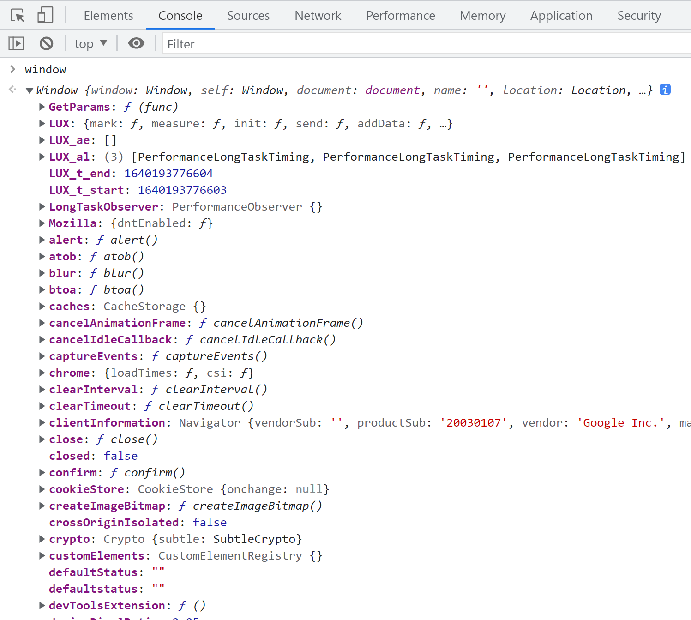

# 前端设计模式应用

## 浏览器中的设计模式
### 单例模式
- 定义: 全局唯一访问对象
- 应用场景: 缓存, 全局状态管理

- 用单例模式实现请求缓存
```typescript
import { api } from "./utils"
const cache: Record<string, string> = {};

export const request = async (url: string) => {
  if (cache[url]) {
    return cache[url]
  }

  const response = await api(url);

  cache[url] = response;
  return response;
}
```
```js
test("should response quickly second time", async () => {
  await request("/user/1");
  await startTime = Date.now()
  await request("/user/1");
  await endTime = Date.now()

  const costTime = endTime - startTime;

  expect(costTime).toBeLessThan(50);
})
```

### 发布订阅模式
- 定义: 一种订阅机制, 可在被订阅对象发生变化时通知订阅者
- 应用场景: 从系统架构之间的解耦, 到业务中一些实现模式, 像邮件订阅, 上线订阅等等, 应用广泛
```js
const button = document.getElementById("button");

const doSomething = () => {}

button.addEventListener('click', doSomething)
```

- 用发布订阅模式实现用户上线订阅
```typescript
type Notify = (user: User) => void;

export class User {
  name: string;
  status: "offline" | "online";
  followers: { user: User; notify: Notify }[];
  
  constructor(name: string) {
    this.name = name;
    this.status = "offline";
    this.followers = [];
  }

  subscribe(user: User, notify: Notify) {
    user.followers.push({ user, notify });
  }
  
  online() {
    this.status = "online";
    this.followers.forEach(({ notify}) => {
      notify(this);
    })
  }
}

```
```js
test("should notify followers when user is online for multiple users", () => {
  const user1 = new User("user1");
  const user2 = new User("user2");
  const user3 = new User("user3");

  const mockNotifyUser1 = jest.fn();
  const mockNotifyUser2 = jest.fn();

  user1.subscribe(user3, mockNotifyUser1);
  user2.subscribe(user3, mockNotifyUser2);
  
  user3.online();

  expect(mockNotifyUser1).toBeCalledWith(user3);
  expect(mockNotifyUser2).toBeCalledWith(user3);
})
```


## JavaScript 中的设计模式
### 原型模式
- 定义: 复制已有对象来创建新的对象
- 应用场景: JS 中对象创建的基本模式
- 用原型模式创建上线订阅中的用户
```javascript
const baseUser: User = {
  name: "",
  status: "oofline",
  followers: []

  subscribe(user, notify) {
    user.followers.push({ user, notify });
  }
  online() {
    this.statis = "online";
    this.followers.forEach(({ notify}) => {
      notify(this)
    })
  }
}
export const createUser = (name: string) => {
  const user: User = Object.create(baseUser);

  user.name = name;
  user.followers = [];

  return user;
}
```
```javascript
test("should notify followers when user is online for user prototypes", () => {
  const user1 = createUser("user1");
  const user2 = createUser("user2");
  const user3 = createUser("user3");

  const mockNotifyUser1 = jest.fn();
  const mockNotifyUser2 = jest.fn();

  user1.subscribe(user3, mockNotifyUser1);
  user1.subscribe(user3, mockNotifyUser2);

  user3.online();

  expect(mockNotifyUser1).toBeCalledWith(user3);
  expect(mockNotifyUser2).toBeCalledWith(user3);
})
```
### 代理模式
- 定义: 可自定义控制对原对象的访问方式, 并且允许在更新前后做一些额外处理
- 应用场景: 监控, 代理工具, 前端框架实现等
- 使用
- 使用代理模式实现用户状态订阅
```typescript
type Notify = (user: User) => void;

class User {
  name: string;
  status: "offline" | "online";
  followers: { user: User; notify: Notify }[];
  
  constructor(name: string) {
    this.name = name;
    this.status = "offline";
    this.followers = [];
  }

  subscribe(user: User, notify: Notify) {
    user.followers.push({ user, notify });
  }
  
  online() {
    this.status = "online";
  }
}
```
```typescript
export const createProxyUser = (name: string) => {
  const user = new User(name);

  const proxyUser = new Proxy(user, {
    set: (target, prop: keyof User, value) => {
      target[prop] = value;
      if (prop === "status") {
        notifyStatusHandlers(target, value);
      }
      return true;
    }
  })
  const notifyStatusHandlers = (user: User, status: "online" : "offline") => {
    if (status === "online") {
      user.followers.forEach(({notify}) => {
        notify(user);
      })
    }
  }
  return proxyUser;
}
```
### 迭代器模式
- 定义: 在不暴露数据类型的情况下访问集合中的属性
- 应用场景: 数据结构中有多种数据类型, 列表, 树等, 提供通用操作接口
- 用 for of 迭代所有组件
```typescript
class MyDomElement {
  tag: string;
  children: MyDomElement[];
  constructor(tag: string) {
    this.tag = tag;
    this.children = [];
  }

  addChildren(component: MyDomElement) {
    this.children.push(component);
  }

  [Symbol.iterator]() {
    const list = [...this.children];
    let node;

    return {
      next: () => {
        while ((node = list.shift())) {
          node.children.length > 0 && list.push(...node.children);

          return { value: node, done: false};
        }
        return { value: null, done: true };
      }
    }
  }
}
```
```typescript
test("can iterate root element", () => {
  const body = new MyDomElement("body");
  
  const header = new MyDomElement("header");
  
  const main = new MyDomElement("main");

  const banner = new MyDomElement("banner");
  const content = new MyDomElement("content");

  const footer = new MyDomElement("footer");

  body.addChildren(header);
  body.addChildren(main);
  body.addChildren(footer);

  body.addChildren(banner);
  body.addChildren(content);

  const expectTags: string[] = [];
  for (const element of body) {
    if (element) {
      expectTags.push(element.tag);
    }
  }

  expect(expectTags.length).toBe(5)
})
```
## 前端框架中的设计模式
### 代理模式
- Vue组件实现计数器
```vue
<template>
  <button @click="count++">count is: {{ count }}</button>
</template>
<script setup lang="ts">
import { ref } from "vue";
const count = ref(0);
</script>
```
- 前端框架中对 DOM 操作的代理
  - 更改 DOM 属性 -> 更新虚拟 DOM -> 视图更新
### 组合模式
- 定义: 可多个对象组合使用, 也可单个对象独立使用
- 应用场景: DOM, 前端组件, 文件目录, 部门
- React 组件结构

```jsx
export const Count = () => {
  const [count, setCount] = useState(0);
  return (
    <button onClick={() => setCount((count) => count + 1)}>
      count is: {count}
    </button>
  )
}
```
```jsx
function App() {
  return (
    <div className="App">
      <Header />
      <Count />
      <Footer />
    </div>
  )
}
```

## 总结
设计模式不是**银弹**
- 总结出抽象的模式相对比较简单, 但是想要将抽象的模式套到场景中却非常困难
- 现代编程语言的多编程范式带来的更多可能性
- 真正优秀的开源项目学习设计模式并不断实践