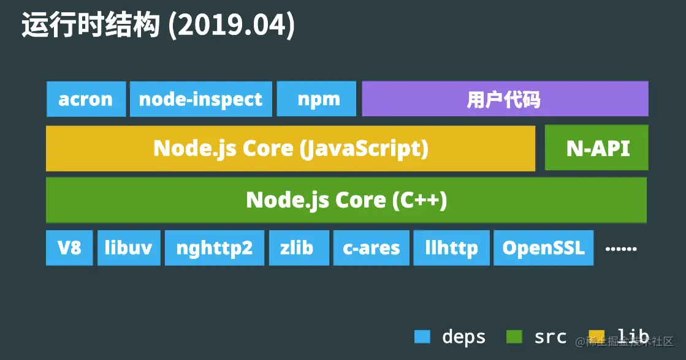
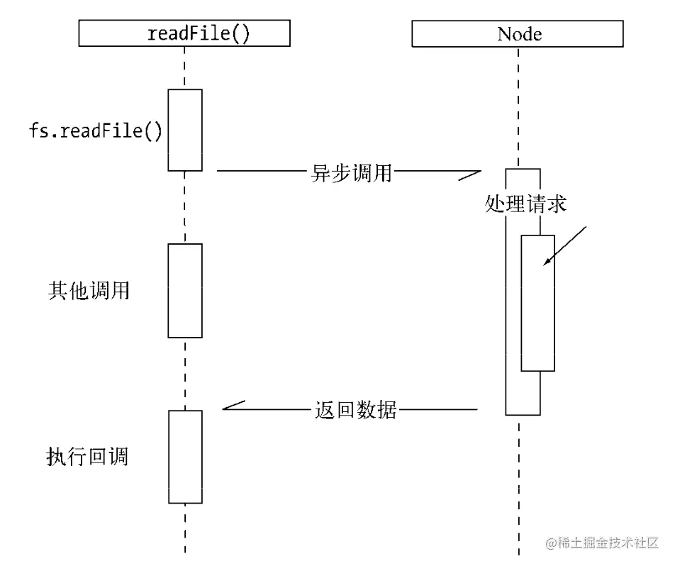

# Node.js 与前端开发实战

## 一、Node.js 的应用场景
1. 前端工程化
- Bundle: webpack, vite, esbuild, parcel
- Uglify: uglifyjs
- Transpile: bablejs, typescript
- 其他语言加入竞争: esbuild, parcel, prisma
- 现状: 难以替代
2. Web 服务端应用
- 学习曲线平缓, 开发效率高
- 运行效率接近常见的编译语言
- 社区生态丰富及工具链成熟(npm, V8 inspector)
- 与前端结合的场景会有优势(SSR)
- 现状: 竞争激烈, Node.js有自己独特的优势
4. Electron 跨端桌面应用
- 商业应用: vscode, slack, discord, zoom 
- 大型公司内的效率工具
- 现状: 大部分场景在选型时, 都值得考虑
## 二、Node.js 运行时结构


- v8: JavaScript Runtime, 诊断调试工具(inspector)
- libuv: eventloop(事件循环), syscall(系统调用)
- 举例: 用node-fetch发起请求时...
### 特点
- 异步`I/O`
当`Node.js`执行`I/O`操作时, 会在响应返回后恢复操作，而不是阻塞线程并占用额外内存等待

- 单线程
  - JS 单线程 (实际: JS 线程 + uv 线程池 + V8 任务线程池 + V8 Inspector 线程)
  - 优点: 
    - 不用考虑多线程状态同步问题，也不需要锁
    - 同时还能比较高效地利用系统资源
  - 缺点
    - 阻塞会产生更多负面影响
    - 解决方法
      - 多线程或多进程
-  跨平台
   - Node.js 跨平台 + JS 无需编译环境 (+ Web 跨平台 + 诊断工具跨平台)
    -  = 开发成本低(大部分场景无需担心跨平台问题), 整体学习成本低

## 三、编写 Http Server
```js
const http = require('http')
const port = 3000
const server = http.createServer((req, res) => {
    res.send('hello')
})
server.listen(port, () => {
    console.log(`server listens on: ${port}`) 
})
```
### 编写静态文件服务
```js
const http = require('http')
const fs = require('fs')
const path = require('path')
const url = require('url')

const port = 3000
const server = http.createServer((req, res) => {
    const info = url.parse(req.url)
    const file = fs.createReadStream(path.resolve(__dirname, '.' + info.pathname))
    file.pile(res)
})
server.listen(port, () => {
    console.log(`server listens on: ${port}`)
})
```
与高性能、可靠的服务相比, 还差什么? 
1. CDN: 缓存 + 加速
2. 分布式储存, 容灾
### React SSR
- SSR 有什么特点
    - 相比传统HTML模板引擎: 避免重复编写代码
    - 相比SPA: 首屏加载快, SEO友好
    - 缺点: 通常qps较低, 前端代码编写时需要考虑服务端渲染情况
```js
const http = require('http')

const port = 3000
const server = http.createServer((req, res) => {
    res.setHeader('Content-Type', 'text/html')
    res.end(`
        <DOCTYPE html>
        <html>
            <head>
                <title>My App</title>
            </head>
            <body>
                <h1>My App</h1>
            </body>
        </html>
    `)
})
server.listen(port, () => {
    console.log(`server listens on: ${port}`)
})
```
替换成React
```jsx
const http = require('http')
const React = require('react')
const ReactDOMServer = require('react-dom/server')

function App() {
    return React.createElement('h1', {
        children: 'Hello',
    })
}

const port = 3000
const server = http.createServer((req, res) => {
    res.setHeader('Content-Type', 'text/html')
    res.end(`
        <DOCTYPE html>
        <html>
            <head>
                <title>My App</title>
            </head>
            <body>
                <div id="main">
                    ${ReactDOMServer.renderToString(
                        React.createElement(App)
                    )}
                </div>
            </body>
        </html>
    `)
})
server.listen(port, () => {
    console.log(`server listens on: ${port}`)
})
```
SSR 难点:
1. 需要处理打包代码
```js
require('./static/style.css')
```
2. 需要考虑前端代码在服务端运行时逻辑
```js
async componentDidMount() {
    const res = await fetch('http://my.server.domain')
}
```
3. 移除对服务端无意义的副作用, 或重置环境
## 四、Debug
- V8 Inspector: 开箱即用、特征丰富强大、与前端开发一致、跨平台
    - node --inspect
    - open `http://localhost:9229/json`
- 场景
    - 查看console.log内容
    - breakpoint
    - 高CPU、死循环: cpuprofile
    - 高内存占用: heapsnapshot
    - 性能分析
## 五、部署
- 部署要解决的问题
    - 守护进程: 当进程退出时，重新拉起
    - 多进程: cluster便捷地利用多进程
    - 记录进程状态, 用于诊断
- 容器环境
    - 通常有健康检查的手段，只需考虑多核cpu利用率