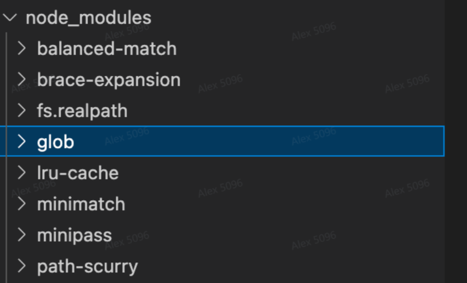
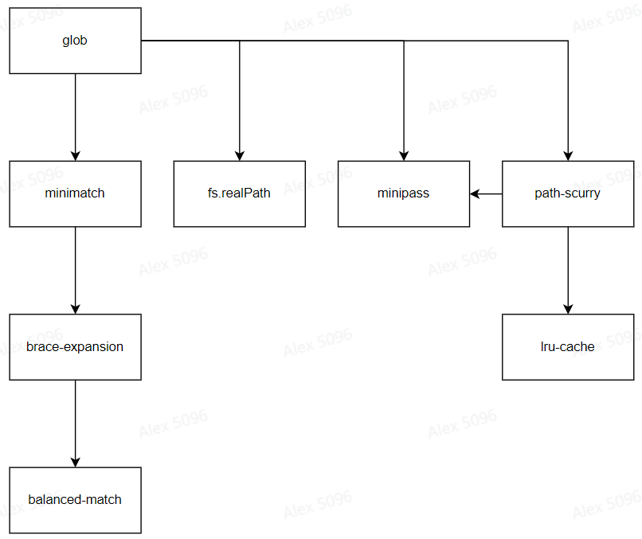

# NPM Package 分析工具

## 背景
`NodeJS` 包管理逻辑非常复杂, 直观感受是`npm install` 后常常会安装许多不明所以的包

下面例子中, 仅声明了`glob`依赖, 却带来了`balanced-match`等总计7个子包
```bash
{
  "name": "tmp3",
  "version": "1.0.0",
  "description": "",
  "main": "index.js",
  "scripts": {
  },
  "keywords": [],
  "author": "",
  "license": "ISC",
  "dependencies": {
    "glob": "^10.1.0"
  }
}
```


分析这些包的`package.json`可以发现它们之间形成如下依赖关系:



项目变大后, 依赖变多后, 这种依赖关系会变得非常复杂, 常常让我们看不清:
- 为什么会安装某个特定的`package`
- 为什么某些`package`会安装多个版本
- 子`package`之间形成了怎样的父子依赖关系
- 是否存在循环依赖
- 等等
因此期望实现一个工具, 从`package.json`出发, 递归遍历所有`node_modules`中的`package.json`生成模块依赖关系图

## 需求
- 需要封装为`node`命令行工具
- 支持`xx-cli analyze`命令, 用于分析从当前目录`package.json`开始递归查找到的全量依赖关系(包名 & 版本号), 分析完成后自动打开网页, 并渲染依赖关系图;
  - 注意处理好**循环依赖**问题, 避免陷入死循环
  - 支持`--depth=n`参数, 限制向下递归分析的层次深度
  - 支持`--json=[file-path]`参数, 传入后不再打开网页, 只是将依赖关系以`JSON`形式存储到用户指定的文件
- 在打开页面中, 除了渲染依赖关系图外, 期望对依赖关系做出初步分析, 例如:
  - 是否包含循环依赖
  - 同一个`package`是否包含多个版本实例

## 技术栈
- 功能开发
  - 依赖关系图: `antv/x6`、`echarts`、`D3`均可
- 工程化
  - 使用`TypeScript`开发
  - 使用`vitest/jest`实现单元测试
  - 接入`eslint`、`lint-staged`工具

## 产出
- 源码, 期望提交到`github`
- 发布到`npm`的`CLI`工具包
- 项目说明文档
