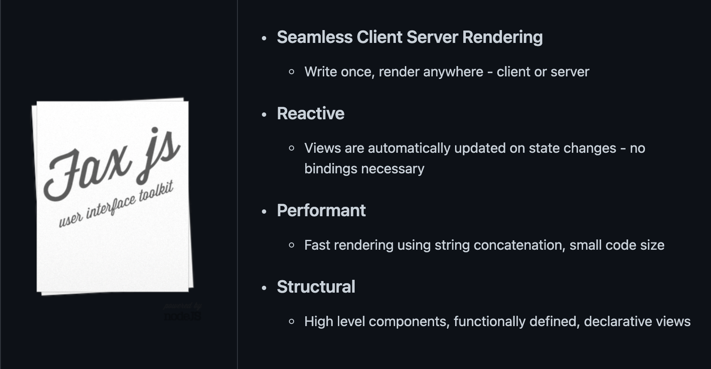
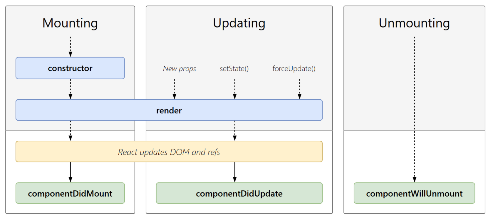
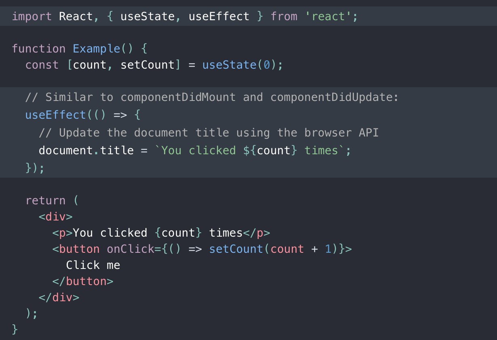
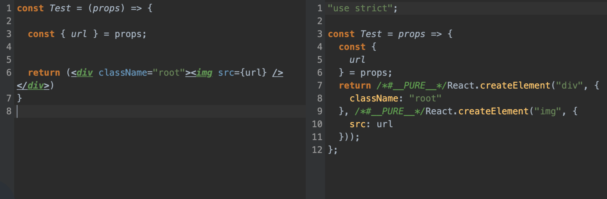
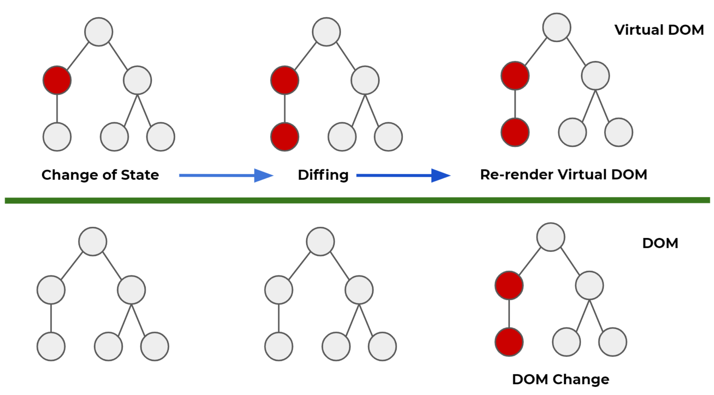

# 响应式系统 与 React

## 一、React 历史与应用
- 2010年, Facebook 在其 php 生态中, 引入 xhp 框架, 首次引入组合式组件的思想, 启发了后来的 React 的设计
- 2011年, Jordan Walke 创造了 FaxJS , 也就是后来的 React 原型

- 2012年, 在 Facebook 收购 Instagram 后, 该 FaxJS 项目在内部得到使用,   Jordan Walke 基于 FaxJS 经验, 创造了 React
- 2013年, React 正式开源, 在 2013 JSConf 上 Jordan Walke 介绍了这款全新的框架
## 二、React 设计思路
### UI 编程痛点
1. 状态更新, UI 不会自动更新, 需要手动地调用 DOM 进行更新
2. 欠缺基本的代码层面的封装和隔离, 代码层面没有组件化
3. UI 之间的数据依赖关系, 需要手动维护, 如果依赖链路长, 则会遇到 "Callback Hell" (回调地狱)
### 响应式与转换式
- 转换式系统: 给定输入求解输出, 如编译器、数值计算
- 响应式系统: 监听事件, 消息驱动, 如监控系统、UI 界面
  - 过程: 绑定事件 -> 执行既定的回调 -> 状态变更
### React 的设计与实现
- 状态更新, UI 自动更新
- 前端代码组件化, 可复用, 可封装
  - 组件是 组件的组合/原子组件
  - 组件内拥有状态, 外部不可见
  - 父组件可将状态传入组件内部
- 状态之间的互相依赖关系, 只需声明即可
### React 设计思路
- 组件归属问题: 状态归属与两个节点向上寻找到最近的祖宗节点
  - 思考:
  - React 是单向数据流还是双向数据流
  - 如何解决状态不合理上升问题
  - 组件的状态改变后, 如何更新 DOM
- 组件化
  - 组件内部拥有私有状态 State
  - 组件接收外部的 Props 状态提供复用性
  - 根据当前的 State / Props, 返回一个 UI
```js
function Components(props) {
  // props 是父组件传入的状态
  const { url } = props
  this.text = 'click me!' // 状态
  // 返回一个 "UI"
  return (<div>
    <SubComponent props={{ color: 'red'}}></SubComponent>
    </img>
    <button>text</button>
  </div>)
}
```
- 组件生命周期


## 三、React (hooks) 写法

## 四、React 实现
### JSX 不符合 JS 标准
- Babel


### 返回的 JSX 发生改变, 如何更新DOM
- Virtual DOM 

它赋予了 React 声明式的 API: 您告诉 React 希望让 UI 是什么状态, React 就确保 DOM 匹配该状态。这使您可以从属性操作、事件处理和手动 DOM 更新这些在构建应用程序时必要的操作中解放出来 


### State/Props 更新, 要重新触发 render 函数
- Diff
## 五、React 状态管理库
### 核心思想
将状态抽离到 UI 外部进行统一管理
### 状态管理库
- redux
- xstate
- mobx
- recoil

## 六、应用级框架普及
### NEXT
稳定, 开发体验好, 支持 Unbundled Dev, SWC 等, 其同样有 Serverless 一键部署平台帮助开发者快速完成部署
### MODERN.js
字节跳动 Web Infra 团队研发的全栈开发框架, 内置了很多开箱即用的能力与最佳实践, 可以减少很多调研选择工具的时间
### Blitz
无 API 思想的全栈开发框架, 开发过程中无需写 API 调用与 CRUD 逻辑, 适合前后端紧密结合的小团队项目