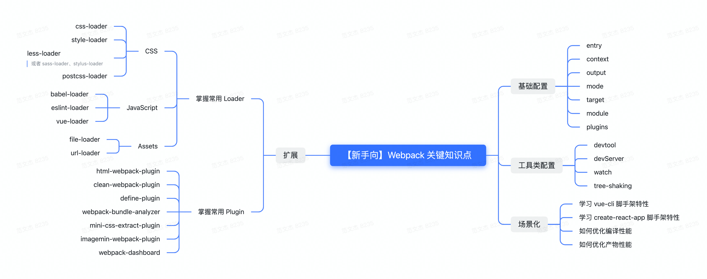

# 构建 Webpack 知识体系

## 一、什么是 Webpack
本质上是一种前端资源编译、打包工具
- 多份资源文件打包成一个 Bundle
- 支持 Babel、Eslint、TS、CoffeeScript、Less、Sass
- 支持模块化处理 CSS、图片等资源文件
- 支持 HMR + 开发服务器
- 支持持续监听、持续构建
- 支持代码分离
- 支持 Tree-shaking
- 支持 Sourcemap

## 二、使用 Webpack
### 实例
1. 安装
```shell
npm i -D webpack webpack-cli
```
2. 编辑配置文件
-webpack.config.js
```js
module.exports = {
  entry: 'main.js',
  output: {
    filename: '[name].js',
    path: path.join(__dirname, './dist')
  },
  module: {
    rules: [{
      test: /\.less$/i,
      use: ['style-loader', 'css-loader', 'less-loader']
    }]
  }
}
```
3. 执行编译命令
```shell
npx webpack 
```

### 核心流程
- 1. 入口处理
  - 从 entry 文件开始, 启动编译流程
- 2. 依赖解析
  - 从 entry 文件开始, 根据 require or import 等语句找到依赖资源
- 3. 资源解析
  - 根据 module 配置, 调用资源转移器, 将 png、css等非标准 js 资源转译为 js 内容
  - 递归调用2、3直到所有资源处理完毕
- 4. 资源合并打包
  - 将转译后的资源内容合并打包为直接在浏览器运行的 js 文件

### 模块化 + 一致性
- 多个文件资源合并成一个, 减少 http 请求数
- 支持模块化开发
- 支持高级 JS 特性
- 支持 Typescript、CoffeeScript 方言
- 统一图片、CSS、字体等其他资源的处理模型

### 使用 Webpack
- 配置分为两类
  - 流程类: 作用于流程中某个 or 若干个环节, 直接影响打包效果的配置项
  - 工具类: 主流程之外, 提供更多工程化能力的配置项

#### 流程类配置
- Get Start (输入)
  - entry
  - context
- Dependencies Lookup (模块解析)
  - resolve
  - enternals
- Transform (模块转译)
  - module
- Combine Assets
  - optimization
  - mode
  - target

1. 处理CSS
- Loader 有什么用? 为什么这里需要用到 css-loader、style-loader ?
- 与旧时代 -- 在 HTML 文件中维护 css 相比, 这种方式会有什么优劣处 ?
- 有没有接触过 Less、Sass、Stylus 这一类 css 预编译框架? 如何在 Webpack 接入这些工具?
> 参考资料
>
> [CSS Loader](https://github.com/webpack-contrib/css-loader)
> 
> [style-loader](https://webpack.js.org/loaders/style-loader/)
> 
> [Webpack 原理系列七：如何编写loader](https://mp.weixin.qq.com/s/TPWcB4MfVrTgFtVxsShNFA)

2. 接入 Babel
- Babel 具体有什么功能?
- Babel 与 Webpack 分别解决了什么问题? 为何两者能协作到一起了?

> 参考资料
>
> [babel-loader](https://webpack.js.org/loaders/babel-loader/)
>
> [Babel 官网](https://babeljs.io/)
>
> [@babel/preset-env](https://babeljs.io/docs/babel-preset-env)
>
> [@babel/preset-react](https://babeljs.io/docs/babel-preset-react)
>
> [@babel/preset-typescript](https://babeljs.io/docs/babel-preset-typescript)

3. 生成 HTML
- 相比于手工维护 HTML 内容, 这种自动生成的方式有什么优缺点?

> 参考资料
>
> [HtmlWebpackPlugin](https://webpack.js.org/plugins/html-webpack-plugin/)

4. HMR
5. Tree-Shaking
6. 其他工具
- 缓存
- Sourcemap
- 性能监控
- 日志
- 代码压缩
- 分包

## 三、理解 Loader
用于将资源翻译为标准 JS

### 特点
- 链式执行
- 支持异步执行
- 分 normal、pitch 两种模式

> 参考资料
>
> [Webpack 原理系列七：如何编写loader](https://mp.weixin.qq.com/s/TPWcB4MfVrTgFtVxsShNFA)

### 常见 Loader
- JS
  - babel-loader
  - eslint-loader
  - ts-loader
  - buble-loader
  - vue-loader
  - angular2-template-loader
- CSS
  - css-loader
  - style-loader
  - less-loader
  - sass-loader
  - stylus-loader
  - postcss-loader
- HTML
  - html-loader
  - pug-loader
  - posthtml-loader
- Assets
  - file-loader
  - val-loader
  - url-loader
  - json5-loader

### 理解插件
- Loader 输入是什么? 要求的输出是什么?
- Loader 的链式调用是什么意思? 如何串联多个 Loader ?
- Loader 中如何处理异步场景?

## 四、插件
对扩展开放、对修改封闭

### 钩子
1. 时机: 编译过程的特定节点, Webpack 会以钩子形式通知插件此刻正在发生什么事情;
  - compier.hooks.compilation
2. 上下文: 通过 tapable 提供的回调机制, 以参数方式传递上下文信息
   - compilation
3. 交互: 在上下文参数对象中附带了很多存在 side effect 的交互接口, 插件可以通过这些接口改变
   - dependencyFactories.set

### 理解插件
- Loader 与 插件有什么区同点?
- 钩子有什么作用? 如何监听钩子函数

> 参考资料
>
> [[源码解读] Webpack 插件架构深度讲解](https://mp.weixin.qq.com/s/tXkGx6Ckt9ucT2o8tNM-8w)
>
> [[万字总结] 一文吃透 Webpack 核心原理](https://mp.weixin.qq.com/s/SbJNbSVzSPSKBe2YStn2Zw)


## 五、学习方法
1. 入门应用
   - 理解打包流程
   - 熟悉掌握常用配置项、Loader、插件的使用方法, 能够灵活搭建集成 Vue、React、Babel、Eslint、Less、Sass、图片等工具的 Webpack 环境
   - 掌握常见脚手架工具的用法, 例如 Vue-cli、create-react-app、@angular/cli
2. 进阶
   - 理解 Loader、Plugin 机制, 能够自行开发 Webpack 组件
   - 理解常见性能优化手段, 并能用于解决实际问题
   - 理解前端工程化概念与生态现状
3. 大师级
   - 理解源码, 理解 Webpack 编译、打包原理、甚至能够参与共建

