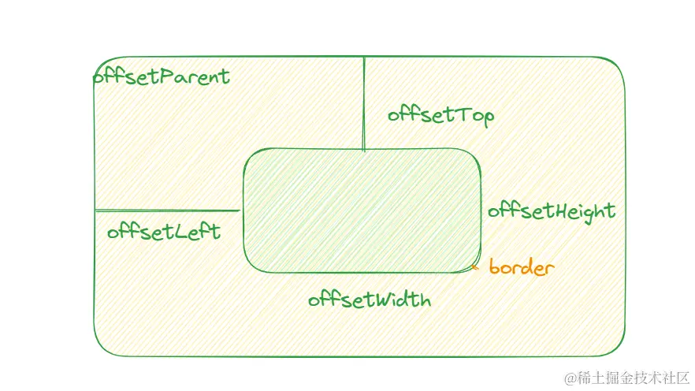
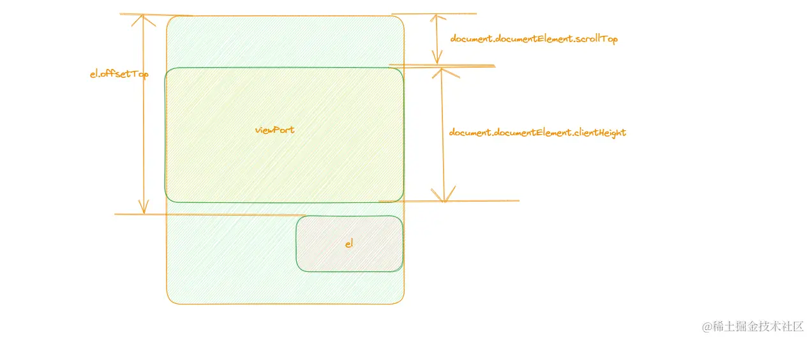
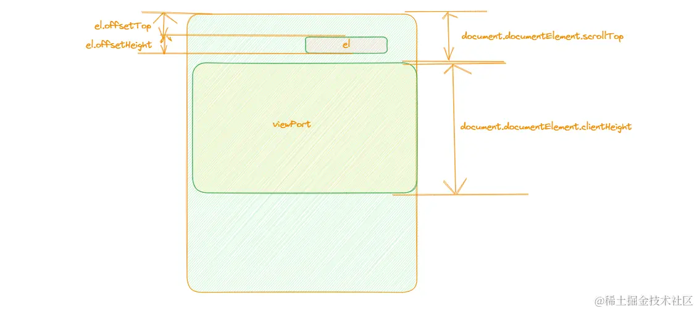
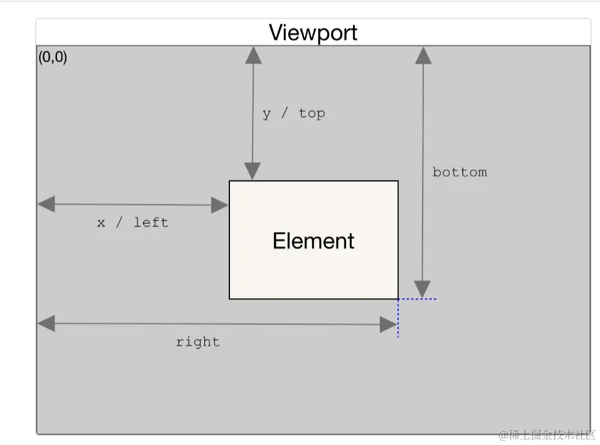

# 判断元素在可视区范围

## 一、offsetTop 和 scrollTop
1. offsetTop: 当前元素相对于其 offsetParent 元素的顶部内边距的距离
- offsetParent: 指向最近的包含该元素的定位元素或最近的 table、td、th、body元素

> offsetWidth 包括 content、padding 和 border, 不包括 margin
> 
> clientWidth 包括 content、padding, 不包括 border 和 margin
2. scrollTop: 元素的内容顶部到它的视口可见内容的顶部的距离的度量
- 在下方

- 在上方

```js
const isInView = (el) => {
  const documentScrollTop = document.documentElement.scrollTop
  const documentClientHeight = document.documentElement.clientHeight
  if (el.offsetTop > documentScrollTop + documentClientHeight) {
    console.log("元素在可视区域下方")
  } else if (el.offsetTop + el.offsetHeight < documentScrollTop) {
    console.log("元素在可视区域上方")
  } else {
    console.log('在可视区域啦');
  }
}
const scrollEvent = throttle(isInView)
document.addEventListener('scroll', () => {
  scrollEvent(targetNode)
})
```

## 二、getBoundingClientRect
`Element.getBoundingClientRect`返回一个`DOMRect`对象, 其提供了元素的大小及其相对于视口的位置

- width 实际上是 width + padding + border
- y 实际上是 top + margin, bottom 是 y + width
```js
const targetNode = document.querySelector(".child")
const isInView = (el) => {
  const documentClientHeight = document.documentElement.clientHeight
  const { bottom, y } = el.getBoundingClientRect()
  if (bottom < 0) {
    console.log("元素在可视区域上方")
  } else if (y > documentClientHeight) {
    console.log("元素在可视区域下方")
  } else {
    console.log('在可视区域啦');
  }
}
const scrollEvent = throttle(isInView)
document.addEventListener('scroll', () => {
  scrollEvent(targetNode)
})
```
## 三、IntersectionObserver
`IntersectionObserver`提供了异步观察目标元素与祖先元素或顶级文档视口交叉状态的方法。

Intersection Observer API 会注册一个回调函数，每当被监视的元素进入或者退出另外一个元素时 (或者 viewport)，或者两个元素的相交部分大小发生变化时，该回调方法才会被触发执行
```js
const targetNode = document.querySelector(".child")
const intersectionObserver = new IntersectionObserver((entries) => {
  if (entries[0].intersectionRatio <= 0) {
    console.log("可视区域外")
  } else {
    console.log("可视区域内")
  }
})
intersectionObserver.observe(targetNode)
```