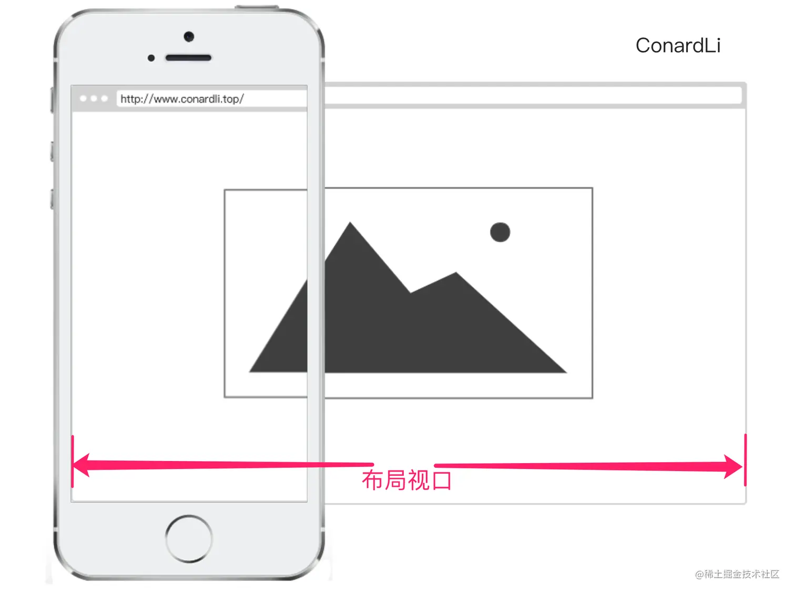
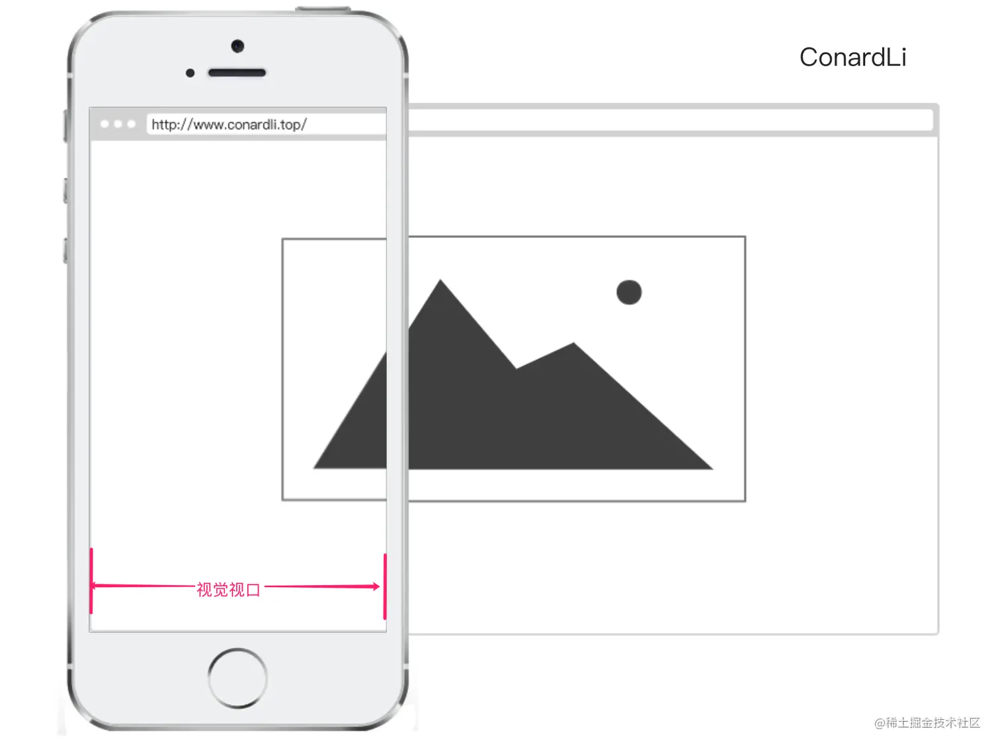
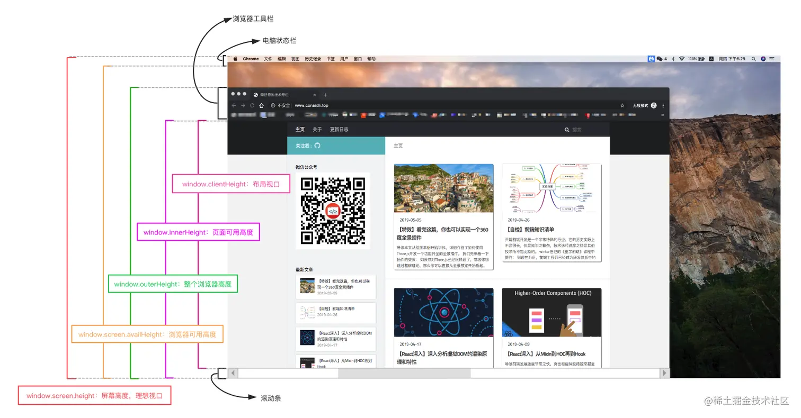

# 移动端适配

## 一、像素
### 1. 设备像素(dp)和设备分辨率
设备像素也叫物理像素, 它具有特定的位置和颜色, 可以作为屏幕的最小组成单位。

设备分辨率是屏幕的宽和高具体由多少个像素点组成。

### 2. 设备独立像素(dips)
设备独立像是操作系统定义的一种像素单位，应用程序将设备独立像素告诉操作系统，操作系统再将设备独立像素转化为设备像素，从而控制屏幕上真正的物理像素点。

> iPhone6 的物理像素是 750×1334，逻辑像素是 375×667, 设备像素比是 2, 这意味着我们把 2×2 的物理像素当成 1×1 的像素来使用。当我们设置某元素的宽度为 10px 时，我们实际上是在设置逻辑像素
> 在PC端，1CSS 像素仍表现为 1物理像素，但是在移动端设备上（包括安卓手机），此后就出现了逻辑像素的概念，1CSS 像素在物理上具体的像素值由设备不同的逻辑像素决定

### 3. css 像素 (px)
- css 像素与设备独立像素的关系
  - 页面缩放系数 = css 像素 / 设备独立像素(dips)
  - 在缩放比例为 100%, 1 个 css 像素大小等于 1 个设备独立像素
  - 在缩放比例为 200%, 1 个 css 像素大小等于 2 个设备独立像素

- css 像素与设备像素的关系
  - window.devicePixelRatio 设备像素比(dpr)
  - devicePixelRatio = 设备像素(dp) / css像素

## 二、视口
### 1. 布局视口(layout viewport)

布局视口，即网页布局的区域, 它是 html 元素的父容器，只要不在 css 中修改元素的宽度, 元素的宽度就会撑满布局视口的宽度。
- 在 PC 浏览器中, 缩放为 100% 时, 布局视口等于内容窗口宽度
- 在移动端中, 缩放为 100% 时, 布局视口等于内容窗口宽度不一定等于内容窗口的大小。当你用手机浏览浏览宽大的网页（这些网页没有采用响应式设计）的时候, 你只能一次浏览网页的一个部分，然后通过手指滑动浏览其他部分。这就说明整个网页（布局视口）已经加载出来了，只不过你要一部分一部分地看。
- 通过 `document.documentElement.clientWidth / clientHeight` 获取布局视口大小

### 2. 视觉视口(visual viewport)

视觉视口, 显示在屏幕的网页区域
- 默认等于当前浏览器窗口大小(包括滚动条宽度)
- 通过 `document.innerWidth / innerHeight` 获取布局视口大小
> visual viewport 就像一台摄像机，layout viewport 就像一张纸，摄像机对准纸的哪个部分，你就能看见哪个部分

### 3. 理想视口 
网站页面在移动端展示的理想大小, 它的单位正是设备独立像素
- 页面的缩放系数 = CSS 像素 / 设备独立像素, 实际上说的是 页面的缩放系数 = 理想视口宽度 / 视觉视口宽度
- 通过 `window.screen.width / height` 来获取理想视口大小

### 4. 利用 meta 标签对 viewport 进行控制
`<meta>` 告诉浏览器如何解析页面, 可以借助该元素的 viewport 来帮助设置视口、缩放
```html
<meta name="viewport" content="width=device-width, initial-scale=1, maximum-scale=1, user-scalable=no">
```
|     Value     |         可能值          |                         描述                          |
| :-----------: | :---------------------: | :---------------------------------------------------: |
|     width     |  正整数或device-width   |      以pixels（像素）为单位， 定义布局视口的宽度      |
|    height     |  正整数或device-height  |      以pixels（像素）为单位， 定义布局视口的高度      |
| initial-scale |       0.0 - 10.0        |                 定义页面初始缩放比率                  |
| minimum-scale |       0.0 - 10.0        |   定义缩放的最小值；必须小于或等于maximum-scale的值   |
| maximum-scale |       0.0 - 10.0        |   定义缩放的最大值；必须大于或等于minimum-scale的值   |
| user-scalable | 一个布尔值（yes或者no） | 如果设置为 no，用户将不能放大或缩小网页。默认值为 yes |


## 三、移动端适配
### 1. 媒体查询
不同设备尺寸编写不同 css 属性
```css
@media (max-width: 550px) {
}
```

### 2. rem
rem 是相对于根元素的字体大小的单位

设置 html 的 font-size 为 16px，则如果需要设置元素字体大小为 16px，则写为 1rem

借助`@media`设置不同设备根元素的字体大小
```css
@media only screen and (min-width: 375px) {
  html {
    font-size : 375px;
  }
}

@media only screen and (min-width: 360px) {
  html {
    font-size : 360px;
  }
}

@media only screen and (min-width: 320px) {
  html {
    font-size : 320px;
  }
}

//定义方法：calc
@function calc($val){
    @return $val / 1080;
}

.logo{
	width : calc(180rem);
}

```


### 3. flexible 
```js
// set 1rem = viewWidth / 10
function setRemUnit () {
    var rem = docEl.clientWidth / 10
    docEl.style.fontSize = rem + 'px'
}
setRemUnit();
```
将 html 节点的 font-size 设置为页面 clientWidth(布局视口)的 1/10，即 1rem 就等于页面布局视口的 1/10，这就意味着我们后面使用的 rem 都是按照页面比例来计算的。

> 由于 viewport 单位得到众多浏览器的兼容，lib-flexible 这个过渡方案已经可以放弃使用，不管是现在的版本还是以前的版本，都存有一定的问题。建议大家开始使用 viewport 来替代此方案。


### 4. viewport 适配方案

vh、vw 方案将视觉视口宽度 window.innerWidth 和 视觉视口高度 window.innerHeight 等分为100份
- vw: 1vw 等于 window.innerWidth 的 1%
- vh: 1vh 等于 window.innerHeihgt 的 1%
- vmin: 当前 vw 和 vh 中较小的值
- vmax: 当前 vw 和 vh 中较大的值

```scss
.logo {
  font-size: 10vw; // 1vw = 750px * 1% = 7.5px
}
```

1. 设置 meta 标签
```html
<meta name="viewport" content="width=device-width, initial-scale=1.0, maximum-scale=1.0, user-scalable=0">
```

2. px 自动转 vw
- [postcss-px-to-viewport插件](https://github.com/evrone/postcss-px-to-viewport)


## 四、若干场景实践
### 1px
- 伪元素 + 缩放
```css
.calss1 {
  position: relative;
  &::after {
    content:"";
    position: absolute;
    bottom:0px;
    left:0px;
    right:0px;
    border-top:1px solid #666;
    transform: scaleY(0.5);
  }
}
```
### 图片高清

### iPhoneX适配方案

### 横屏适配 
- js 检测
```js
window.addEventListener("resize", ()=>{
    if (window.orientation === 180 || window.orientation === 0) { 
      // 正常方向或屏幕旋转180度
        console.log('竖屏');
    };
    if (window.orientation === 90 || window.orientation === -90 ){ 
       // 屏幕顺时钟旋转90度或屏幕逆时针旋转90度
        console.log('横屏');
    }  
}); 
```

- css 检测
```css
@media screen and (orientation: portrait) {
  /*竖屏...*/
} 
@media screen and (orientation: landscape) {
  /*横屏...*/
```

### 浏览器大小获取

- window.innerHeight：获取浏览器视觉视口高度（包括垂直滚动条）。
- window.outerHeight：获取浏览器窗口外部的高度。表示整个浏览器窗口的高度，包括侧边栏、窗口镶边和调正窗口大小的边框。
- window.screen.Height：获取获屏幕取理想视口高度，这个数值是固定的，设备的分辨率/设备像素比
- window.screen.availHeight：浏览器窗口可用的高度。
- document.documentElement.clientHeight：获取浏览器布局视口高度，包括内边距，但不包括垂直滚动条、边框和外边距。
- document.documentElement.offsetHeight：包括内边距、滚动条、边框和外边距。
- document.documentElement.scrollHeight：在不使用滚动条的情况下适合视口中的所有内容所需的最小宽度。测量方式与clientHeight相同：它包含元素的内边距，但不包括边框，外边距或垂直滚动条。


:::tip 来源
- [关于移动端适配，你必须要知道的](https://juejin.cn/post/6844903845617729549?searchId=20230926162739F27F92A7C7038C29D2B0)
- [2022 年移动端适配方案指南 — 全网最新最全](https://juejin.cn/post/7046169975706353701)
- [*深入浅出移动端适配（总结版)](https://juejin.cn/post/6844903951012200456)
:::