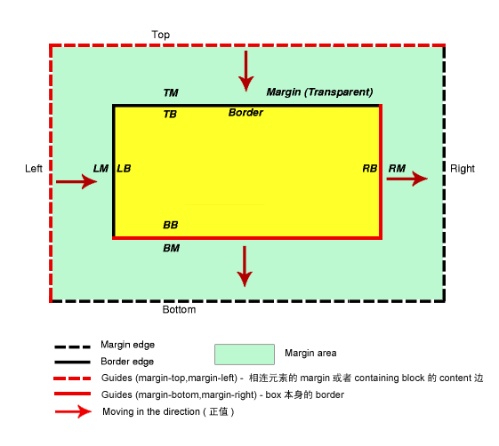

# margin 负值

## 参考线
参考线就是就是 margin 移动的基准点

top、left 以外元素作为参考线, right、bottom 以自身作为参考线

- top 负值以包含块内容区域的上边或上方相连元素 margin 的 下边作为参考线
- left 负值以包含块内容区域的左边或做方相连元素 margin 的 右边作为参考线
- right 负值就是以元素本身 border 的右边作为参考线
- bottom 负值就是以元素本身 border 的下边作为参考线

红色箭头表示正值时候的移动方向，当margin为负值的时候就反方向移动。

## 分类讨论
### 1. 元素没有设置浮动且没有设置定位或者 position 为 static
- 设置的 margin 的方向为 top 或者 left, 元素按照设置的方向移动相应的距离
- 设置的 margin 的方向为 bottom 或者 right, 元素本身不会移动, 元素后面的元素会往该元素方向移动相应的距离, 并且**覆盖在该元素上面**
- 在元素不指定宽度情况下, 如果设置 margin-left 或者 margin-right 为负值, 会在元素相应的方向上增加其宽度。效果等同于 padding-left 或者 padding-right 一样

### 2. 元素没有设置浮动且 position 为 relative
- 设置的 margin 的方向为 top 或者 left, 元素按照设置的方向移动相应的距离
- 设置的 margin 的方向为 bottom 或者 right, 元素本身不会移动, 元素后面的元素会往该元素方向移动相应的距离, 但是**该元素会覆盖在后面的元素上面**
  
### 3. 元素没有设置浮动且 position 为 absolute
- 设置的 margin 的方向为 top 或者 left, 元素按照设置的方向移动相应的距离
- 设置的 margin 的方向为 bottom 或者 right, 由于设置绝对定位的元素已经脱离了标准文档流, 对后面的元素没有影响

### 4. 元素设置浮动
- 设置的 margin 方向与浮动的方向相同, 那么元素会往对应的方向移动相应的距离
- 设置的 margin 方向与浮动的方向相反, 则元素本身不动, 元素之前或之后的元素会向该元素的方向移动相应的距离, 同时覆盖在该元素之上

## 总结
- `margin-left` 元素自身向上移动, 同时会影响下方的元素向上移动
- `margin-botom` 元素自身不会位移，但是会减少自身供css读取的高度，从而影响下方的元素会向上移动。
- `margin-left` 元素自身会向左移动，同时会影响其它元素；
- `margin-right` 元素自身不会位移，但是会减少自身供css读取的宽度，从而影响右侧的元素会向左移动；

> 通过负边距进行偏移的元素，它会放弃偏移前占据的空间，这样它后面文档流中的其它元素就会“流”过来填充这部分空间。
> 文档流只能是后面的流向前面的，即文档流只能向左或向上流动，不能向下或向右移动

:::tip 参考
- [理解并运用 CSS 的负 margin 值](https://segmentfault.com/a/1190000007184954#item-8)
- [【面试题解】CSS盒子模型与margin负值](https://juejin.cn/post/7025880293013716999?searchId=2023091110471320EA34D8E17572BAF243)
- [浅谈margin负值](https://zhuanlan.zhihu.com/p/25892372)
:::