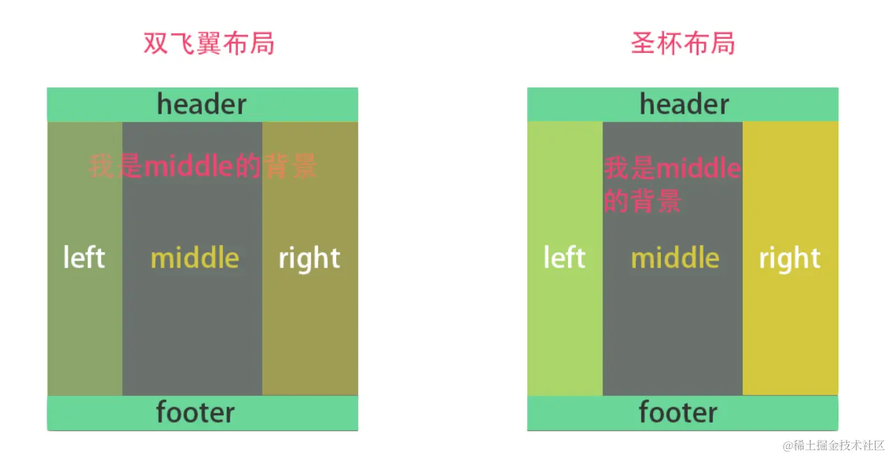

# 三栏布局
## 三栏布局
```html
<div class="container">
  <div class="left">left</div>
  <div class="middle">middle</div>
  <div class="right">right</div>
</div>
```

```css
.container {
    display: flex;
}

.container div {
    height: 400px;
}

.left,
.right {
    width: 200px;
    background-color: orange;
}

.middle {
    flex: 1;
    background-color: pink;
}
```
缺点
- 左右两边先加载, 中间再加载(一般情况下两边为广告)
## 圣杯
```html
<div class="container">
  <div class="middle">middle</div>
  <div class="left">left</div>
  <div class="right">right</div>
</div>
```
```css
.container div {
    height: 400px;
}

.container {
    padding: 0 200px;
}

.left,
.right {
    width: 200px;
    background-color: orange;
}

.middle {
    background-color: pink;
    width: 100%;
}

.middle,
.left,
.right {
    float: left;
}

.left {
    position: relative;
    /* 相对于父容器宽度 */
    margin-left: -100%;
    /* 相对于自身宽度 */
    left: -200px;
}

.right {
    position: relative;
    margin-right: -200px;
}
```
由于设置了相对定位, 所以当 left 原来的位置和 right 的位置产生重叠时, 由于浮动的原因一行放不下就会换行
## 双飞翼
```html
<div class="container">
  <div class="middle">
    <div class="inner">
        middle
    </div>
  </div>
  <div class="left">left</div>
  <div class="right">right</div>
</div>
```

```css
.container div {
    height: 400px;
}

.left,
.right {
    width: 200px;
    background-color: orange;
}

.middle {
    background-color: pink;
    width: 100%;
}

.inner {
    width: 100%;
    padding: 0 200px;
}

.middle,
.left,
.right {
    float: left;
}

.left {
    margin-left: -100%;
}

.right {
    margin-left: -200px;
}
```


## 总结
相同之处: 让三列浮动, 通过负外边距形成三列布局

不同之处: 处理中间主列的位置
- 圣杯是布局利用父容器的左右内边距 + 两个列的相对定位
- 双飞翼布局是把主列嵌套在一个新的父级块中利用主列的左右外边距进行布局调整

:::tip 来源
- [面试官：如何实现三栏布局，中间自适应](https://juejin.cn/post/7276398869734817832#heading-2)
:::