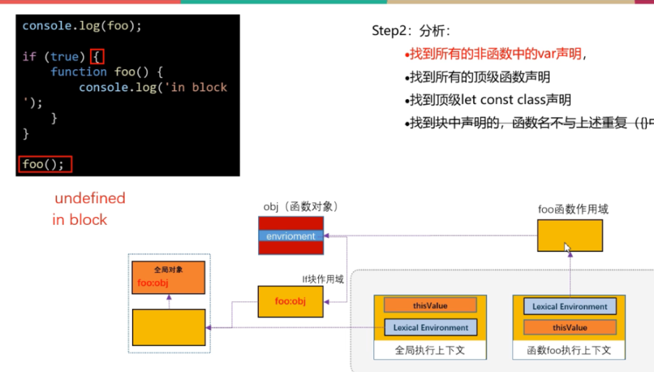

# 执行上下文与作用域

## 一、执行上下文(Execution Context)
- 文本环境(语法环境): 在 `js` 代码执行之前, 登记代码中所有变量名、函数名、类名
- thisValue
### 1.创建新的执行上下文的情形
- 进入全局代码
- 进入 `function` 函数体代码
- 进入 `eval` 函数参数指定的代码
- 进入 `module` 代码
### 2.全局执行上下文的特点
1. 文本环境分为两部分: 全局对象和全局 `scope`
- `var` 和 `function` 声明创建在全局对象中
- `let` 、 `const` 和 `class` 声明的变量在全局 `scope` 中
2. 先在全局 `scope` 中找变量, 查找不到再从全局对象中查找
```javascript
let a = 'alex';
console.log(a); // 'alex'
console.log(window.a); undefined
var b = 'alex';
console.log(b); // 'alex'
console.log(window.b); // 'alex'
let Function = 'alex';
console.log(Function); // 'alex'
console.log(window.Function); // ƒ Function() { [native code] }
```
## 二、执行栈(Execution Context Stack)
- 执行栈栈顶的执行上下文成为当前执行上下文
- `JS` 代码总是在当前上下文中执行
- `JS` 代码需要用到的资源，到当前执行上下文中查找
## 三、JS引擎执行代码的操作
#### 1.全局作用域和函数作用域
1. 创建全局执行上下文, 并加入栈顶
2. 分析:
- 找到所有非函数中的 `var` 声明
- 找到所有的顶级函数声明
- 找到所有的顶级 `let`、`const` 和 `class` 声明
- 找到块中声明的、函数名不与上述重复的函数
3. 名字重复处理
- `let`、`const`、`class` 声明之前不能重复(否则会报错)
- `let`、`const`、`class` 和 `var`、`function` 的名字不能重复(否则会报错)
- `var` 和 `function` 的名字不能重复, `function` 声明的函数名优先
4. 创建绑定
- 登记并初始化 `var` 为 `undefined`
- 顶级函数声明：登记 `function` 的名字，并初始化为新创建的函数对象
  - 函数对象体内保存函数创建时的执行上下文环境(造成闭包)
  - 函数的文本环境保存在 `scoped` 中
- 块中声明的函数在全局对象中创建一个以函数名为名的变量，并将它初始化为 `undefined`
- 登记 `let` 、`const` 和 `class`，但为初始化
5. 执行语句
#### 2.块级作用域
1. 创建新的 `文本环境` ，连接到原先记录之后
2. 分析
- 找到所有的顶级函数声明
- 找到 `let` 、`const` 声明
3. 名字重复处理
- `function` 和 `let`、`const` 名字不重复
- `let` 和 `const` 之间名字不重复
4. 创建绑定
- 登记 `function` 名字，并初始化为新创建的函数对象
- 登记 `let`、`const`，但为初始化
5. 执行语句
6. 在退出块时候(案例5)
- 在全局对象中查看是否与块级作用域中函数同名的变量，如果有，将把块中的函数的值赋值给全局中同名的变量，没有的话不进行处理。

## 四、作用域
解析 (查找) 变量名的一个集合, 就是当前运行上下文(也就是当前上下文的语法环境)
- 全局作用域就是全局运行上下文
- 函数作用域就是函数运行上下文 (在函数创建时决定而不是调用的时候决定)

## 五、案例
1. `var`提升

2. 临时死区

`let`声明的变量有提升但是未初始化, 未初始化的变量不可使用

3. 函数的作用域
    
函数的作用域是在函数创建的时候决定而不是调用的时候决定

并非根据调用嵌套形成(运行上下文)作用域链，而是根据函数创建嵌套形成作用域链，也就是函数书写位置形成作用域链，因此称为**语法作用域链**

4. 块级作用域

不会创建一个新的执行上下文，而是创建一个新的文本环境，连接到原来的文本环境

块级作用域执行完毕后，会将文本环境销毁，并把全局上下文环境接回原来的文本环境

5. 块级作用域声明函数


6. 循环`var`

7. 循环`let`

```javascript
for (let i = 0; i < 5; i++) {
    let i = 29;
    console.log(i);
}
// 29 29 29 29 29
```
## 六、总结
1. `JS` 变量先登记后使用，登记的地方成为执行上下文
- `var` 变量和函数声明登记时，创建在全局对象上，同时初始化，有"提升"现象
- `let`、`const` 和 `class` 声明登记时，创建在全局块上，未初始化，不能"提前"使用
- 作用域可以理解为当前执行上下文
2. 4种情况会创建新的执行上下文: `全局`、`function`、`eval` 和 `modul`
3. 函数的作用域，只与其被创建时的执行上下文相关联。