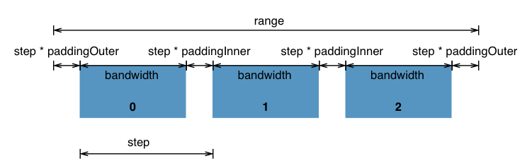

# 比例尺
将抽象的维度数据映射为可视化表示

## 线性比例尺 (scaleLinear)
```js
var linear = d3.scaleLinear()
    .domain([10, 130]) 
    .range([0, 960]); 

x(20); // 80
x(50); // 320
```
- linear(x): 输入定义域, 返回值域  
- linear.invert(y): 输入值域, 返回定义域 
- linear.domain([numbers]): 设定或者获取定义域                                                                     
- linear.range([values]): 设定或者获取值域                                                                       
- linear.nice([count]): 可以将定义域的范围自动扩展为较为理想的范围                                             
- linear.ticks([values]): 设定或者获取比较有代表性的值的数目。默认为10， 主要获取坐标轴的刻度                    
- linear.tickFormat(count [, format]): 设定定义域内具有代表性的值的表示形式。比如显示到小数点后两位，适用百分比例行使现实数据
## 分段比例尺 (scaleBand)


- d3.scaleBand(): 使用空的 domain，单位 range：[0, 1]，不设置 padding, 不设置 rounding 以及 alignment 构造一个新的分段比例尺。
- band.paddingInner([padding]): 如果指定了 padding 则将分段的内部间隔设置为指定的值，值的范围必须在 [0, 1] 之间. 如果没有指定 padding 则返回当前的内部间隔，默认为 0. 内部间隔决定了两个分段之间的间隔比例。
- band.paddingOuter([padding]): 如果指定了 padding 则将分段的外部间隔设置为指定的值，值的范围必须在 [0, 1] 之间. 如果没有指定 padding 则返回当前的外部，默认为 0. 外部决定了第一个分段之前与最后一个分段之后的间隔比例。
- band.align([align]): 如果指定了 align 则设置分段的对其方式，值处于 [0, 1] 之间。如果没有指定 align 则返回当前的对其方式，默认为 0.5。对其方式决定了输出区间的分布方式。0,5 表示第一个分段前和最后一个分段之后的未使用空间一致。使用 0 或者 1 可以将分段整体向某一侧对齐。
- band.bandwidth(): 返回每一个分段的宽度。
- band.step(): 返回相邻的两个分段的起点之间的距离。