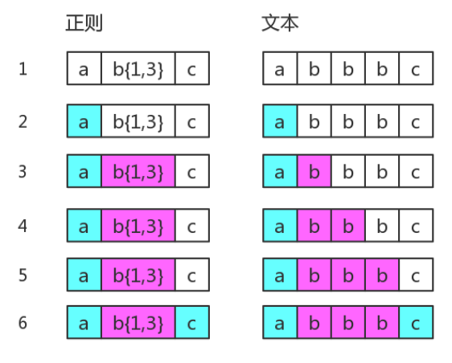
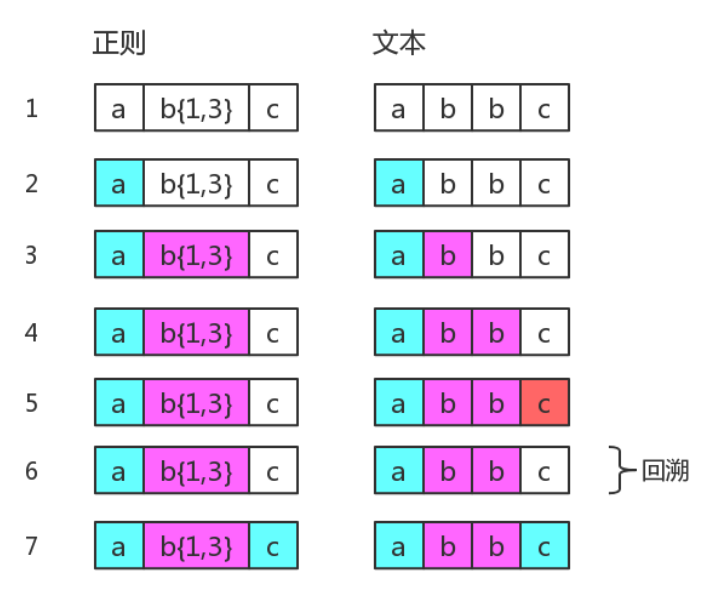
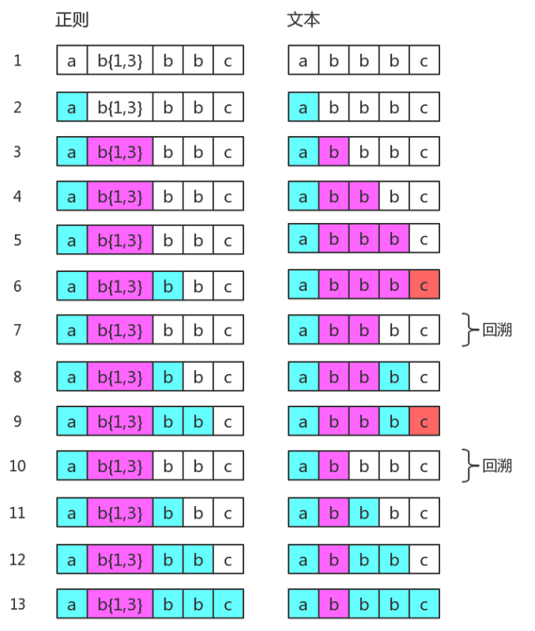
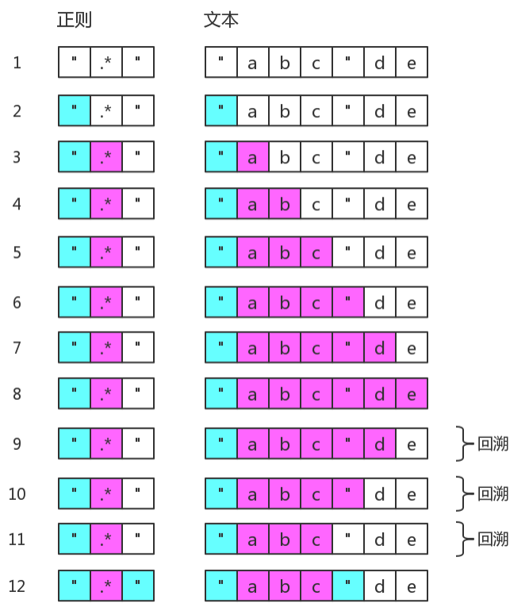
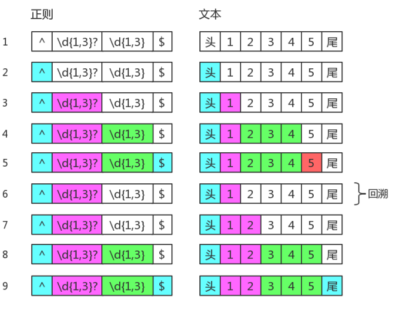
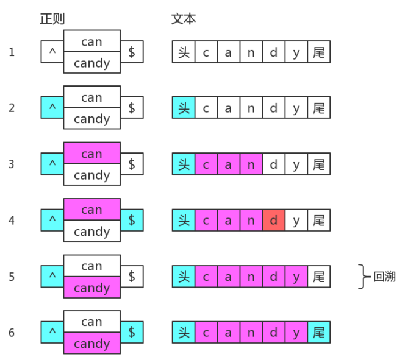

# 回溯

## 一、没有回溯的匹配
```js
const regex = /ab{1,3}c/
const str = "abbbc"
```



## 二、有回溯的匹配
1. 案例1
```js
const regex = /ab{1,3}c/
const str = "abbc"
```


2. 案例2
```js
const regex = /ab{1,3}bbc/
const str = "abbbc"
```


3. 案例3
```js
const regex = /".*"/
const str = '"abc"de'
```


可以看出`.*` 非常的影响效率

为了减少不必要的回溯, 可以把正则修改为 `/"[^"]*"/`


## 三、常见的回溯形式

回溯的本质是深度优先搜索算法, 其中退到之前的某一步这一过程, 称为"回溯"

### 贪婪量词
尝试的顺序是从多往少的方向去尝试
```js
const regex = /(\d{1,3})(\d{1,3})/
const str = "12345"
console.log(string.match(regex)) // ["12345", "123", "45", index: 0, input: "12345"]
```

### 惰性量词
尽可能少的匹配

```js
const regex = /(\d{1,3}?)(\d{1,3})/
const str = "12345"
console.log(string.match(regex)) // ["12345", "1", "234", index: 0, input: "12345"]
```

惰性量词也具有回溯现象
```js
const regex = /\d{1,3}?\d{1,3}$/
const str = '12345'
```


### 分支结构
分支结构, 可能前面的子模式会形成了局部匹配, 如果接下来表达式整体不匹配时, 仍会继续尝试剩下的分支, 这种尝试也是一种回溯

```js
const regex = /(?:can|candy)$/
const str = "candy"
```

