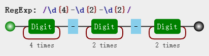
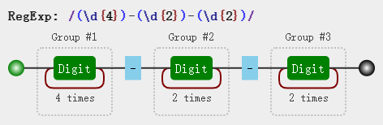

# 括号的作用

括号提供分组, 便于我们引用它

## 一. 分组和分支结构
强调括号内的正则是一个整体, 即提供子表达式
### 分组
```js
const str = "ab abab ababab"
const regex = /(ab)+/g
console.log(str.match(regex)) // [ 'ab', 'abab', 'ababab' ]
```
括号提供分组功能, 使得量词 `+` 作用于 `ab` 整体
### 分支结构
```js
const regex = /^I love (js|regex)$/
console.log(regex.test("I love js")) // true
console.log(regex.test("I love regex")) // true 
```

## 二. 括号引用
以日期为例, 假设格式是 `yyyy-mm-dd`

可以写出如下正则 `/\d{4}-\d{2}-\d{2}/`, 可视化如图所示:



添加括号后 `/(\d{4})-(\d{2})-(\d{2})/`, 可视化如图所示:




对比两个的可视化图片, 发现后者与前者相比多了个分组编号, 如 Group #1

正则引擎在匹配过程中, 给每个分组都开辟了一个空间, 用于存储每一个分组匹配到的数据

### 提取
- match

match 返回的是一个数组, 第一个元素是整体匹配的结果, 然后是各个分组匹配的内容, 然后是匹配下标, 最后是输入的文本。另外正则表达式是否有修饰符 g , match 返回的数组的格式是不一样的。
```js
const regex = /(\d{4})-(\d{2})-(\d{2})/
const str = "2023-09-18"

console.log(str.match(regex))
// [
//   '2023-09-18',
//   '2023',
//   '09',
//   '18',
//   index: 0,
//   input: '2023-09-18',
//   groups: undefined
// ]
```

> 

- 也可以使用正则实例对象的 exec 方法
```js
const regex = /(\d{4})-(\d{2})-(\d{2})/
const str = "2023-09-18"

console.log(regex.exec(str))
// [
//   '2023-09-18',
//   '2023',
//   '09',
//   '18',
//   index: 0,
//   input: '2023-09-18',
//   groups: undefined
// ]
```

- 同时也可以使用构造函数的全局属性 $1 至 $9 来获取
```js
const regex = /(\d{4})-(\d{2})-(\d{2})/
const str = "2023-09-18"

regex.test(str) // 正则操作即可
// regex.exec(str) 
// str.match(regex)

console.log(RegExp.$1) // "2023"
console.log(RegExp.$2) // "09"
console.log(RegExp.$3) // "18"
```

### 替换
`yyyy-mm-dd` 替换为 `mm/dd/yyyy`
```js
const regex = /(\d{4})-(\d{2})-(\d{2})/
const str = "2023-09-18"
console.log(str.replace(regex, '$2/$3/$1')) // 09/18/2023
```
其中 replace 中, 第二个参数里用 $1, $2, $3 指代相应的分组

## 三. 反向引用
要求日期前后分割符相同
```js
const regex = /\d{4}(-|\/|\.)\d{2}\1\d{2}/
const str1 = '2023-09-18'
const str2 = '2023/09/18'
const str3 = '2023.09.18'
const str4 = '2023/09-18'

console.log(regex.test(str1))
console.log(regex.test(str2))
console.log(regex.test(str3))
console.log(regex.test(str4))
```
- `\1` 引用之前的第一个分组

### 括号嵌套
以**左括号**为准
```js
const regex = /^((\d)(\d(\d)))\1\2\3\4$/
const str = "1231231233"
console.log(regex.test(str)) // true
console.log(RegExp.$1) // 123
console.log(RegExp.$2) // 1
console.log(RegExp.$3) // 23
console.log(RegExp.$4) // 3
```

### \10
`\10` 表示第 10 个分组
```js
const regex = /(1)(2)(3)(4)(5)(6)(7)(8)(9)(#) \10+/
const str = "123456789# ######"

console.log(regex.test(str))
```

> 如果真要匹配 `\1` 和 `0`, 使用 `(?:\1)0` 或 `\1(?:0)`

### 引用不存在的分组
因为是反向引用, 如果引用不存在的分组时, 不会报错, 相当于匹配反向引用字符本身。例如, `\2` 就匹配 `\2`, 表示对 2 进行转义

### 分组后面有量词
分组后有量词的话, 分组最终捕获到的数据是最后一次的匹配
```js
const regex = /(\d)+/
const str = "12345"

console.log(str.match(regex)) // [ '12345', '5', index: 0, input: '12345', groups: undefined ]
```

反向引用也是如此
```js
const regex2 = /(\d)+ \1/
console.log(regex2.test("12345 1")) // false
console.log(regex2.test("12345 5")) // true
```

## 四. 非捕获符号
默认情况下出现的括号都会捕获它们匹配到的数据, 以便后续引用, 因此也称它们为捕获型分组和捕获型分支

如果只想要括号最原始的功能，但不会引用它，即，既不在 API 里引用，也不在正则里反向引用。

此时使用非捕获括号 `(?:p)` 和 `(?:p1|p2|p3)`

## 五. 案例
### trim
- 匹配到开头和结尾的空白符然后替换成空字符 
```js
function trim(str) {
  return str.replace(/^\s+|\s+$/g, '')
}

console.log(trim("  foo  ")) // foo
```
- 匹配整个字符串, 然后用引用提取相应的数据
```js
function trim(str) {
  return str.replace(/^\s*(.*?)\s*$/g, "$1")
}

console.log(trim("  foo  ")) // foo
```
这里采用了惰性匹配`*?`, 不然也会匹配最后一个空格之前的所有空格

当然前者效率更高

### 单词首字母转大写
```js
function titleize(str) {
  return str.toLowerCase().replace(/(^|\s)\w/g, function(c) {
    return c.toUpperCase()
  })
}

console.log(titleize("my name is alexshwing")) // My Name Is Alexshwing
```

### 驼峰化
```js
function camelize (str) {
  return str.replace(/[-_\s]+(.)?/g, function (match, c) {
    return c ? c.toUpperCase() : ""
  })
}

console.log(camelize('-moz-transform')) // MozTransform
```

### 中划线化
```js
function dashrize (str) {
  return str.replace(/([A-Z])/g, '-$1').replace(/[-_\s]+/g, '-').toLowerCase()
}

console.log(dashrize("MozTransform"))
```

### HTML 转义和反转义
1. 将 HTML 特殊字符转为 等值的实体
```js
function escapeHTML (str) {
  const escapeChars = {
    '<': 'lt',
    '>': 'gt',
    '"': 'quot',
    '&': 'amp',
    '\'': '#39'
  }
  return str.replace(new RegExp('[' + Object.keys(escapeChars).join('') + ']', 'g'), function (match) {
    return '&' + escapeChars[match] + ';'
  })
}

console.log(escapeHTML('<div>alexshwing</div>')) // &lt;div&gt;alexshwing&lt;/div&gt;
```
利用构造函数生成正则, 然后替换相应的格式

2. 逆过程
```js
function escapeHTML (str) {
  const htmlEntities = {
    nbsp: ' ',
    lt: '<',
    gt: '>',
    quot: '"',
    amp: '&',
    apos: '\''
  }
  return str.replace(/\&([^;]+);/g, function (match, key) {
    if (key in htmlEntities) {
      return htmlEntities[key] 
    }
    return match
  })
}

console.log(escapeHTML('&lt;div&gt;alexshwing&lt;/div&gt;')) // <div>alexshwing</div>
```

### 匹配成对的标签
```js
const regex = /<([^>]+)>[\d\D]*<\/\1>/

console.log(regex.test("<title>regular expression</title>")) // true
console.log(regex.test("<p>laoyao bye bye</p>")) // true
console.log(regex.test("<title>wrong!</p>")) // false
```