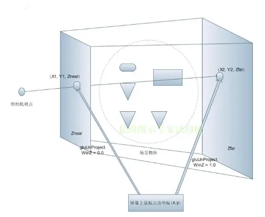
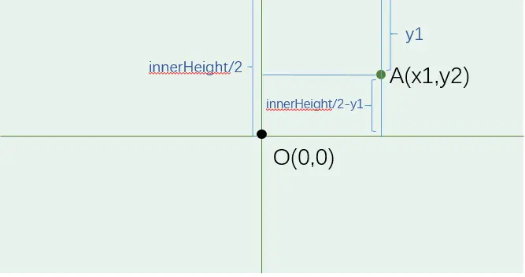

# Raycaster

## 坐标系
### 世界坐标系
在 WebGL 中, 世界坐标系是以屏幕中心为原点 (0, 0, 0), 且是始终不变的。当你面对屏幕时，屏幕的右侧被定义为 x 正轴，屏幕的上方被定义为 y 正轴，而屏幕指向你的方向则是 z 正轴。范围在 (-1, -1, -1) 到 (1, 1, 1), z 值为 -1 表示远平面, 1 表示近平面。

### 屏幕坐标系
在设备上对应的位置

### 视点坐标系
以视点(相机)为原点, 以视线方向为z轴正方向的坐标系的方向。WebGL 会将世界坐标系先变换到视点坐标然后进行裁剪, 只有在视线范围内的场景才会进入下一阶段的计算

## Raycaster
- Raycaster( origin : Vector3, direction : Vector3, near : Float, far : Float )
  - origin —— 光线投射的原点向量。
  - direction —— 向射线提供方向的方向向量，应当被标准化。
  - near —— 返回的所有结果比near远。near不能为负值，其默认值为0。
  - far —— 返回的所有结果都比far近。far不能小于near，其默认值为Infinity（正无穷。）

## 点击物体思路
鼠标点击屏幕时, 获得坐标(x, y), 在加上深度坐标范围(0, 1), 就可以形成两个三维坐标 A(x1, y1, 0) 和 B(x2, y2, 1), 它们转为视点坐标系一定为前剪切平面上的点和后剪切平面上的点, 将它们连线穿过被点击的物体。Three.js 提供射线类 Raycasting 来拾取场景的物体(在实际代码中我们组成射线的两个点是摄像机所在视点与屏幕点击的点连接而成的射线)



## 代码实现
```js
const raycaster = new THREE.Raycaster();
const pointer = new THREE.Vector2();

function onPointerMove( event ) {
	// 将鼠标位置归一化为设备坐标。x 和 y 方向的取值范围是 (-1 to +1)
	pointer.x = ( event.clientX / window.innerWidth ) * 2 - 1;
	pointer.y = - ( event.clientY / window.innerHeight ) * 2 + 1;

}

function render() {
	// 通过摄像机和鼠标位置更新射线
	raycaster.setFromCamera( pointer, camera );
	// 计算物体和射线的焦点
	const intersects = raycaster.intersectObjects( scene.children );
	for ( let i = 0; i < intersects.length; i ++ ) {
		intersects[ i ].object.material.color.set( 0xff0000 );
	}
	renderer.render( scene, camera );
}

window.addEventListener( 'pointermove', onPointerMove );
window.requestAnimationFrame(render);
```

推导过程:
- 获取鼠标点击点为屏幕坐标系点 A(x1, y1) 
  - x1 = event.clientX
  - y1 = event.clientY
  - 坐标系原点为窗口左上角
- 转为世界坐标系点 B(x1', x2')
  - x1' = x1 - innerWidth / 2
  - x2' = innerHeight / 2 - y1
- 将世界坐标系转为视点坐标系 C(xx, yy)
  - xx = x1' / (innerWidth / 2) = (x1 / innerWidth) * 2 - 1
  - yy = x2' / (innerHeight / 2) = 1 - (y1 / innerHeight) * 2



如果 canvas 元素不是全屏的, 需要进一步处理
```js
let px = renderer.domElement.getBoundingClientRect().left;
let py = renderer.domElement.getBoundingClientRect().top;
pointer.x = ( (event.clientX - px) / (renderer.domElement.offsetWidth) ) * 2 - 1;
pointer.y = - ( (event.clientY - py) / (renderer.domElement.offsetHeight) ) * 2 + 1;
```


:::tip 参考
- [ThreeJS中的点击与交互——Raycaster的用法](https://segmentfault.com/a/1190000010490845#item-2)
- [一文学会three.js鼠标交互-Raycaster拾取物体](https://juejin.cn/post/6855129007638183949)
:::