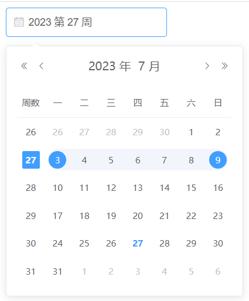
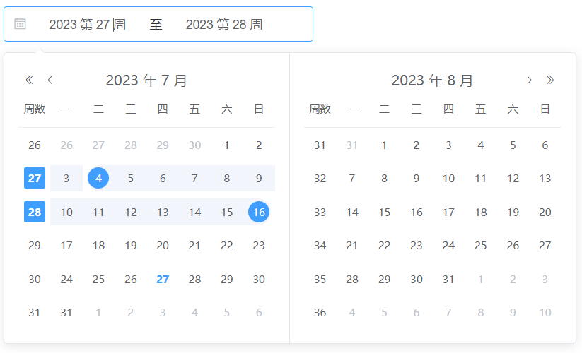

# 周范围选择器

:::tip 原文
[手撸Element源码，完善日期选择器功能，范围选择器周、季、年](https://juejin.cn/post/7239225588065042493)
:::

## 一、准备工作
从 `node_modules\element-ui\packages\date-picker` 复制 `日期选择器` 源码在项目中使用
```vue
<template>
  <div>
    <DatePicker
      v-model="value"
      type="week"
      format="yyyy 第 WW 周"
      placeholder="选择周"
    >
    </DatePicker>
  </div>
</template>
<script>
import DatePicker from '../components/date-picker'
export default {
  components: {
    DatePicker,
  },
}
</script>
```

## 二、周选择器面板显示周数
在 `src/basic/date-table.vue` 中 `props` 中接受一个参数 `showWeekNumber` 这个用于显示周数, 只是父组件没有写入


### 1. 修改 `src/panel/date.vue`
- 将 `showWeekNumber` 绑定到 `DateTable` 组件
```vue{12}
<!-- 91行 -->
<date-table
  v-show="currentView === 'date'"
  @pick="handleDatePick"
  :selection-mode="selectionMode"
  :first-day-of-week="firstDayOfWeek"
  :value="value"
  :default-value="defaultValue ? new Date(defaultValue) : null"
  :date="date"
  :cell-class-name="cellClassName"
  :disabled-date="disabledDate"
+ :showWeekNumber="showWeekNumber"
>
```
- 将 `showWeekNumber` 值跟随模式变化
```javascript{13-15}
selectionMode(newVal) {
  if (newVal === 'month') {
    /* istanbul ignore next */
    if (this.currentView !== 'year' || this.currentView !== 'month') {
      this.currentView = 'month';
    }
  } else if (newVal === 'dates') {
    this.currentView = 'date';
  } else if (newVal === 'years') {
    this.currentView = 'year';
  } else if (newVal === 'months') {
    this.currentView = 'month';
+ } else if (newVal === 'week') {
+   this.showWeekNumber = true
+ }
}
```
### 2.修改 `src/basic/date-table.vue`
- 修改表头显示周数
```vue{3,4}
<!-- 第11行 -->
<tr>
-  <th v-if="showWeekNumber">{{ t('el.datepicker.week') }}</th>
+  <th v-if="showWeekNumber">周数</th>
  <th v-for="(week, key) in WEEKS" :key="key">{{ t('el.datepicker.weeks.' + week) }}</th>
</tr>
```
  - 设置行样式激活
```vue{2,3}
<!-- 第17行 -->
- :class="{ current: isWeekActive(row[1]) }"
+ :class="{ current: isWeekActive(row[showWeekNumber ? 2 : 1]) }"
```
  - 解决选择周后日期错误
> 使用周选择器时，选择后的日期默认是星期一，在西方国家周日则为星期一，所以想要调整可以是使用官方提供的方法 `:picker-options="{firstDayOfWeek:1}"`即可
```vue{6}
<DatePicker
  v-model="value"
  type="week"
  format="yyyy 第 WW 周"
  placeholder="选择周"
+  :picker-options="{firstDayOfWeek:1}">
</DatePicker>
``` 
- 解决周数不对问题
```js{3,5}
// 152行
if (this.showWeekNumber) {
-  if (!row[0]) {
    row[0] = { type: 'week', text: getWeekNumber(nextDate(startDate, i * 7 + 1)) };
-  }
}
```
- 解决选中周不高亮
```scss
<style lang="scss" scoped>
.el-date-table.is-week-mode tr{
  &.el-date-table__row {
    @mixin week () {
      margin-left: 2px;
      margin-right: 2px;
      border-top-left-radius: 0;
      border-bottom-left-radius: 0;
    }
 
    &.current td.week div {
      font-weight: bold;
      background: #fff;
      color: #fff;
      span {
        background: #409EFF;
        border-radius: 2px;
      }
    }
 
    &:hover td {
      &.week div {
        @include week;
      }
 
      &:nth-of-type(2) div {
        margin-left: 5px;
        border-top-left-radius: 15px;
        border-bottom-left-radius: 15px;
      }
    }
 
    td {
      &.week {
        cursor: unset;
        div {
          @include week;
        }
      }
    }
  }
}
</style>

```
### 3. 解决周选择器无法设置`value-format`

**描述**： 周选择器设置`value-format`后`value`格式是正确了，但是控制台报错，组件不回显。

**原因**： 从报错信息可以看出来，都是显示获取操作时间函数，因为现在的值是字符串当然没有这些方法，官方没有对周模式进行兼容。

- 修改 `src/picker.vue`, 重写 `parsedValue` 方法
```javascript
// 549行
parsedValue() {
  const yearStartIndex = this.valueFormat ? this.valueFormat.indexOf('yyyy') : -1
  const weekStartIndex = this.valueFormat ? this.valueFormat.indexOf('WW') : -1
  const weekStartIndex2 = this.valueFormat ? this.valueFormat.indexOf('W') : -1
  if (
    this.value &&
    this.type === 'week' &&
    yearStartIndex > -1 &&
    (weekStartIndex > -1 || weekStartIndex2 > -1)
  ) {
    const year = parseInt(this.value.substring(yearStartIndex, yearStartIndex + 4))
    const week = parseInt(
      this.value
        .substring(weekStartIndex > -1 ? weekStartIndex : weekStartIndex2)
        .replace(/(\d{1,2}).*/g, '$1')
    )
    const firstWeekDayOfYear = new Date(year, 0, 1).getDay()
    let firstThursday = null
    if (firstWeekDayOfYear <= 4) {
      firstThursday = new Date(year, 0, 1 + (4 - firstWeekDayOfYear))
    } else {
      firstThursday = new Date(year, 0, 1 + (11 - firstWeekDayOfYear))
    }
    const weekOfThursday = new Date(
      firstThursday.getTime() + 1000 * 60 * 60 * 24 * 7 * (week - 1)
    )
    return weekOfThursday
  } else {
    if (!this.value) return this.value // component value is not set
    if (this.type === 'time-select') return this.value // time-select does not require parsing, this might change in next major version

    const valueIsDateObject =
      isDateObject(this.value) || (Array.isArray(this.value) && this.value.every(isDateObject))
    if (valueIsDateObject) {
      return this.value
    }

    if (this.valueFormat) {
      return (
        parseAsFormatAndType(this.value, this.valueFormat, this.type, this.rangeSeparator) ||
        this.value
      )
    }

    // NOTE: deal with common but incorrect usage, should remove in next major version
    // user might provide string / timestamp without value-format, coerce them into date (or array of date)
    return Array.isArray(this.value)
      ? this.value.map((val) => new Date(val))
      : new Date(this.value)
  }
},
```


## 三、周选择日期范围

**思路**: 通过`src/picker/date-picker.js`文件可以发现 `elementUI` 做了几个模式然后通过不同的`type`获取不同的日期面板，所以可以把日模式日期选择改造成周模式日期选择器

### 1. 复制文件并新增`weekrange`模式
- 复制`src/panel/date-range.vue`命名为`week-range.vue`
- 在`src/picker/date-picker.js`中新增`weekrange`模式
```javascript{1,7,8,9}
+ import WeekRange from '../panel/week-range'
const getPanel = function (type) {
  if (type === 'daterange' || type === 'datetimerange') {
    return DateRangePanel;
  } else if (type === 'monthrange') {
    return MonthRangePanel;
+  } else if (type === 'weekrange') {
+    return WeekRange
+  }
  return DatePanel;
};
```
### 2. 新增基础配置数据
在 `src\components\date-picker\src\picker.vue` 中
- 添加周范围默认时间格式，110行
```javascript{2}
const DEFAULT_FORMATS = {
+  weekrange: 'yyyywWW'
};
```
- 添加触发类型，124行
```javascript{2}
const HAVE_TRIGGER_TYPES = [
+  'weekrange'
];
```
- 添加类型值映射解析器，171行
```javascript
const TYPE_VALUE_RESOLVER_MAP = {
	weekrange: {
		formatter(value, format) {
			if (Array.isArray(value) && value.length === 2) {
				return [WEEK_FORMATTER(value[0], format), WEEK_FORMATTER(value[1], format)];
			}
      		return '';
		},
    	parser(value, format) {
        	if(Array.isArray(value) && value.length === 2){
          		return [TYPE_VALUE_RESOLVER_MAP.date.parser(value[0], format),TYPE_VALUE_RESOLVER_MAP.date.parser(value[1], format)];
        }
      		return []
    	},
  },
}

const WEEK_FORMATTER = function (value, format) {
  let week = getWeekNumber(value);
  let month = value.getMonth();
  const trueDate = new Date(value);
  if (week === 1 && month === 11) {
    trueDate.setHours(0, 0, 0, 0);
    trueDate.setDate(trueDate.getDate() + 3 - ((trueDate.getDay() + 6) % 7));
  }
  let date = formatDate(trueDate, format);

  date = /WW/.test(date) ? date.replace(/WW/, week < 10 ? '0' + week : week) : date.replace(/W/, week);
  return date;
};

```
- 修改样式

在`src/picker.vue`这个文件中，最外层有个样式是通过`type`生成的，所以生成的`el-date-editor--weekrange`没有这个样式，所以文本框就很短。
```scss
<style lang="scss" scoped>
.el-date-editor--weekrange.el-input__inner{
  width: 350px;
}
</style>

```
### 3.开启周数显示
**修改**：`src/panel/week-range.vue`中`date-table`中添加`:showWeekNumber=true`, 记得两个都要添加
```vue{13}
<date-table
  selection-mode="range"
  :date="rightDate"
  :default-value="defaultValue"
  :min-date="minDate"
  :max-date="maxDate"
  :range-state="rangeState"
  :disabled-date="disabledDate"
  :cell-class-name="cellClassName"
  @changerange="handleChangeRange"
  :first-day-of-week="firstDayOfWeek"
  @pick="handleRangePick"
+  :showWeekNumber=true>
</date-table>
```

### 4. 支持`value-format`
`src/picker.vue`
```javascript
// 提取处理周的方法
parseWeekValue(year,week){
	const firstWeekDayOfYear = new Date(year, 0, 1).getDay()
	let firstThursday = null
	if (firstWeekDayOfYear <= 4) {
		firstThursday = new Date(year, 0, 1 + (4 - firstWeekDayOfYear))
	} else {
		firstThursday = new Date(year, 0, 1 + (11 - firstWeekDayOfYear))
	}
	return new Date(firstThursday.getTime() + (1000 * 60 * 60 * 24 * 7 * (week - 1)))
}

```
```javascript
// 改造计算属性中的parsedValue方法
parsedValue() {
	const yearStartIndex = this.valueFormat ? this.valueFormat.indexOf('yyyy') : -1;
	const weekStartIndex = this.valueFormat ? this.valueFormat.indexOf('WW') : -1;
	const weekStartIndex2 = this.valueFormat ? this.valueFormat.indexOf('W') : -1;
	if (this.value && this.type === 'week' && yearStartIndex > -1 && (weekStartIndex > -1 || weekStartIndex2 > -1)) {
		const year = parseInt(this.value.substring(yearStartIndex, yearStartIndex + 4))
        const week = parseInt(this.value.substring((weekStartIndex > -1 ? weekStartIndex : weekStartIndex2)).replace(/(\d{1,2}).*/g, '$1'))
        return this.parseWeekValue(year,week)
	}else if(Array.isArray(this.value) && this.type === 'weekrange' && yearStartIndex > -1 && (weekStartIndex > -1 || weekStartIndex2 > -1)){
		return this.value.map(date=>{
			const year = parseInt(date.substring(yearStartIndex, yearStartIndex + 4))
			const week = parseInt(date.substring((weekStartIndex > -1 ? weekStartIndex : weekStartIndex2)).replace(/(\d{1,2}).*/g, '$1'))
			return this.parseWeekValue(year,week)
		})
	}else{
		if (!this.value) return this.value; // component value is not set
        if (this.type === 'time-select') return this.value; // time-select does not require parsing, this might change in next major version

        const valueIsDateObject = isDateObject(this.value) || (Array.isArray(this.value) && this.value.every(isDateObject));
        if (valueIsDateObject) {
			return this.value;
		}

		if (this.valueFormat) {
          return parseAsFormatAndType(this.value, this.valueFormat, this.type, this.rangeSeparator) || this.value;
        }

        // NOTE: deal with common but incorrect usage, should remove in next major version
        // user might provide string / timestamp without value-format, coerce them into date (or array of date)
        return Array.isArray(this.value) ? this.value.map(val => new Date(val)) : new Date(this.value);
      }
},
```
### 5. 周高亮
> 思路：在单个周选择器中发现`el-date-table`这个层级上启用`is-week-mode`，在`el-date-table__row`样式行中加上`current`这个类名就可以高亮显示

- 复制`src/basic/date-table.vue`命名为`week-range-table.vue`
- 在`week-range.vue`中引用这个组件
```vue{3,4,17,18,20,22}
<script>
<template>
+ <week-range-table
- <date-table
    selection-mode="range"
    :date="rightDate"
    :default-value="defaultValue"
    :min-date="minDate"
    :max-date="maxDate"
    :range-state="rangeState"
    :disabled-date="disabledDate"
    :cell-class-name="cellClassName"
    @changerange="handleChangeRange"
    :first-day-of-week="firstDayOfWeek"
    @pick="handleRangePick"
    :showWeekNumber=true>
- </date-table>
+ </week-range-table>
</template>
+ import weekRangeTable from '../basic/week-range-table.vue'
export default {
+  components: { TimePicker, DateTable, ElInput, ElButton, weekRangeTable },
}
</script>
```
- 显示`is-week-mode`

`/src/basic/week-range-table.vue`
```vue{3,4}
<table cellspacing="0"
    cellpadding="0"
-   class="el-date-table"
+   class="el-date-table is-week-mode"
    @click="handleClick"
    @mousemove="handleMouseMove"
    :class="{ 'is-week-mode': selectionMode === 'week' }">

```
- 显示`current`

`/src/basic/week-range-table.vue`
```javascript
- :class="{ current: isWeekActive(row[showWeekNumber ? 2 : 1]) }"
+ :class="{ current: isWeekActive(row) }"

+ isWeekActive(row) {
- isWeekActive(cell) {
+  return row.find(v=>v.start) || row.find(v=>v.end)
-  if (this.selectionMode !== 'week') return false
-  const newDate = new Date(this.year, this.month, 1)
-  const year = newDate.getFullYear()
-  const month = newDate.getMonth()
-
-  if (cell.type === 'prev-month') {
-    newDate.setMonth(month === 0 ? 11 : month - 1)
-    newDate.setFullYear(month === 0 ? year - 1 : year)
-  }
-
-  if (cell.type === 'next-month') {
-    newDate.setMonth(month === 11 ? 0 : month + 1)
-    newDate.setFullYear(month === 11 ? year + 1 : year)
-  }
-
-  newDate.setDate(parseInt(cell.text, 10))
-
-  if (isDate(this.value)) {
-    const dayOffset = ((this.value.getDay() - this.firstDayOfWeek + 7) % 7) - 1
-    const weekDate = prevDate(this.value, dayOffset)
-    return weekDate.getTime() === newDate.getTime()
-  }
-  return false
},

```
### 6. 使用
```vue
<DatePicker
  v-model="value"
  type="weekrange"
  format="yyyy 第 WW 周"
  start-placeholder="开始周"
  end-placeholder="结束周"
  range-separator="至"
  showWeekNumber="true"
  :picker-options="{firstDayOfWeek:1}">
</DatePicker>
```
